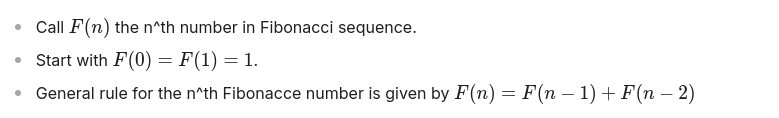

# What is this book about?

미나 개발자 북 페이지에 오신 것을 환영합니다. 이 책은 커뮤니티에서 생산된 모든 기술 정보를 수집하려고 노력할 것입니다. 미나의 활용 사례에 대한 가능성에 대한 관점을 높이는 것이 목표입니다. 물론 이것이 유일한 목표는 아닙니다! 우리의 목표는 커뮤니티의 호기심 많은 사람들을 늘려 새로운 이론, 아이디어, 제품을 만들고 생산하도록 유도하는 것입니다. 이 책의 내용에는 커뮤니티가 참여한 모든 공간에서 축적된 결과물이 포함될 것입니다. 이 책은 매일, 매주 업데이트될 예정입니다. 새로운 기술 업데이트가 있을 때마다 이 책도 최신 버전으로 업데이트될 것입니다(미나 농담!). 또한 미나 프로토콜 웹페이지에서 공식 문서를 확인하시기 바랍니다. 블록체인에 대한 배경 지식이 없다면 이 추가 모듈을 공부하는 것이 도움이 될 수 있습니다. 또한 키워드에 대해서는 용어집을 확인할 수 있습니다.

# Introduction

이 페이지는 개발자 모듈에 대한 소개입니다: 이 모듈은 무엇이며, 목표는 무엇이고, 어떻게 공부해야 하는지 설명합니다. 영지식 앱(zkApp)을 구축하는 것은 ZK 생태계에 익숙하지 않은 사람에게는 어려울 수 있습니다. 블록체인의 근간이 되는 수학의 몇 가지 주제에 대한 이해가 필요합니다. zk가 아닌 다른 체인은 대부분 수학 부분을 추상화하기 때문에 개발자가 직접 처리하지 않아도 됩니다. 그러나 이러한 주제를 배우면 데이터 파밍 시대에 큰 관심사인 사용자의 개인 데이터를 보존할 수 있는 애플리케이션을 만들 수 있는 힘을 얻을 수 있습니다. 이론적인 부분을 시작하기 전에 몇 가지 경로를 알려드리고자 합니다. 이 책은 미나 프로토콜의 zkDSL인 o1js를 사용하여 피보나치 수열을 개발하는 직접적인 개발 경험으로 시작하겠습니다. 나중에는 이론적인 부분도 다루게 되겠지만 걱정하지 마세요! 기초적인 이론 지식을 습득한 후 원하는 대로 이론적인 다이빙을 선택할 수 있습니다.

# Why ZK?

이 페이지에서는 영지식 증명이란 무엇이며, 영지식 증명이 개인 정보 보호 애플리케이션에서 특별한 이유에 대해 소개합니다. 최근 암호화폐 공간을 관찰하다 보면 몇 가지 키워드를 볼 수 있습니다: ZK, 증명, 증명 집계, 비대화성 등. 사람들은 왜 이렇게 영지식 증명에 대해 과대포장하고 있을까요? 사람들은 왜 "ZK가 최종 목표"라는 모토를 내세울까요? 먼저 - 도대체 ZK란 무엇인가요?

# Zero-Knowledge Proofs

영지식 증명이 무엇인지 설명하기 전에 증명 시스템에 대해 조금 이야기해볼 필요가 있습니다. 예를 들어 삼각형의 각의 합은 180도라는 정리의 수학적 증명에 대해 생각해 보세요. 이를 증명하려면 몇 가지 공리부터 시작하여 그 위에 더 많은 블록을 쌓고 결국에는 긴 계산과 수학적 상관관계, 정리 등을 거쳐 요점에 도달하게 됩니다(물론 이 그림에서 삼각형의 예는 장난감에 불과합니다.).

이제 다른 사람에게 어떤 진술을 증명한다고 생각해 보세요. 예를 들어, 세 개의 숫자가 있고 그 합이 나머지가 없이 5로 나뉘어져 있다고 말하려고 합니다. 하지만 숫자가 짝수인지 여부와 같은 숫자에 대한 정보는 공유하고 싶지 않습니다. 프라임이든 아니든. 네거티브 여부.

Zk 증명 시스템은 다음과 같이 짧은 용어로 설명할 수 있습니다:

- 증명자와 검증자가 있습니다. 증명자는 검증자에게 진술을 증명하려고 시도합니다.
- 일반적으로 증명자는 검증자에게 일부 정보를 공유할 수 있습니다. 증명에서 증명문에 대한 정보가 검증자에게 공유되지 않는 경우를 영지식 증명 기반 시스템이라고 합니다.
- 검증 시간이 프로그램을 다시 실행하는 것보다 짧다면, 전송된 증명이 간결하다고 할 수 있습니다.

영지식 증명 기반 애플리케이션 또는 시스템은 당사자 간에 공유할 정보를 지정할 수 있는 강력한 개인정보 보호 통신 방법입니다. 이전 페이지에서 산술 회로를 보셨고 공개/비공개 출력이 있다고 말씀드렸습니다. 이 통신에서 공개 또는 비공개 출력을 지정할 수 있으므로 원하는 만큼 안전하게 통신할 수 있습니다.

영지식 증명에는 몇 가지 지정해야 할 사항이 있습니다:

- 영지식 증명은 암호화 방식이 아닌 증명 방식이기 때문에 정보를 전송할 수 없습니다.
- 영지식 증명은 일반적으로 이전 페이지에서 약간 설명한 몇 가지 제약 조건인 ZK 회로라는 시스템을 구축하여 실행됩니다.

좋아요, 저는 복잡한 주제를 잘 설명하는 전문가가 아니라는 것을 인정합니다. 하지만 이런 일을 할 수 있는 사람이 있습니다: 바로 브랜든 케이스입니다.

# Mathematics of Zero-Knowledge Proofs

이 페이지에서는 ZKP 예선을 공부할 수 있는 자료와 추가 정보를 제공합니다.

# Cryptography\_?

```
- 모든 수학은 암호학(CIA, KGB 등의 자금 지원), 유체역학(원자력 잠수함 제조업체의 지원), 천체역학(NASA 등 미사일을 다루는 군 및 기타 기관의 자금 지원)의 세 부분으로 나뉩니다.

- 암호학은 정수론, 유한필드에 대한 대수 기하학, 대수, 조합론 및 컴퓨터를 탄생시켰습니다.

- 유체역학은 복소해석, 편미분 방정식, 거짓말 군과 대수 이론, 동형학 이론, 과학 컴퓨팅을 발전시켰습니다.

- 천체역학은 동역학 시스템, 선형 대수학, 위상수학, 변미적분학, 심플렉틱 기하학의 기원입니다. -블라디미르 아놀드(Vladimir I. Arnold)

```

지금까지 영지식 증명을 실용적인 의미로 설명했습니다. 사실 저희가 설명드린 모든 개념은 응용 암호학의 일부였습니다.

비트코인과 그 작동 방식에 대해 들어보셨다면 해시 함수 및 이산 로그 문제와 같은 컴퓨터 과학과 암호학의 몇 가지 주제를 알고 계실 것입니다.

'저는 ... 체인 생태계 출신인데, 스마트 컨트랙트나 앱을 작성하기 위해 유한 필드, 머클 트리, 위트니스 등과 같은 주제를 왜 알아야 하나요?"라고 질문할 수 있습니다.

이는 흥미롭고 반직관적인 대답으로 끝날 것입니다: 일반적으로 미나 프로토콜의 스마트 컨트랙트나 앱은 미나 블록체인의 일부 가상머신 내부에서 실행되는 일부 애플리케이션과는 다릅니다. 사실, 스마트 컨트랙트로 작성한 코드는 결국 'ZK 회로'로 변환됩니다(이전에 언급했었죠? 기억하시나요?). 여러분이 작성한 코드는 일련의 제약 조건으로 변환되는, 즉 회로화되기 위해 몇 가지 과정을 거칩니다.

자, 이제 설명은 충분하지 않나요? 이제 미나김치 책 5장에서 암호학의 기초적인 수학을 배우실 것을 권해드리고 싶습니다. 다른 주제는 자유롭게 보셔도 되지만, 6장 이후의 주제는 수학과 조금 거리가 있는 분이라면 이해하기 어려울 수 있습니다.

선택 사항: 고급 리소스 ZK의 수학에 대해 더 자세히 알고 싶거나 사용되는 기본 증명 시스템에 대해 더 자세히 알고 싶을 수도 있습니다. 또한 증명 시스템이 어떻게 구축되는지 궁금하실 수도 있습니다. 다음은 질문에 대한 답을 줄 수 있는 몇 가지 추가 주제입니다. 여기에 있는 모든 자료가 Mina 또는 o1js를 더 잘 배우는 데 필요한 것은 아니지만, 일단 이 자료들을 알고 나면 o1js와 기본 암호화 체계에 대한 가능한 소스 코드 개선 사항을 머릿속에 시각화할 수 있습니다. 학습을 통해 이러한 자료를 다시 사용할 수 있으므로 개발에 도움이 될 것입니다.

# Finite Fields, Elliptic curves and more

- First chapters of Introduction to Mathematical Cryptography

- Cyclic Subgroups

- Elliptic curves and Diffie-Hellman

- First chapters of Programming Bitcoin

- First five chapter of MoonMath Manual.

# Cryptography

- MoonMath Manual chapters 6-8

- Introduction and History of ZK

- Introduction to Modern SNARKS

- SNARKs vs STARKs

- Plonk and Custom gates
  o1js 사용 방법에 대한 더 많은 예제는 예제 폴더에서 확인할 수 있습니다. 또한 이를 복제하여 직접 API를 실험해 볼 수도 있습니다.

# zkFibonacci

이전 파트에서는 ZK의 수학적 개념에 중점을 두었습니다. 이제 직관을 얻기 위해 o1js를 사용한 다음 미나 프로토콜을 배우기 시작합니다. "피보나치 수열은 자연의 설계 방식을 이해하는 열쇠로 밝혀졌으며... 원자, 분자, 결정, 조개, 태양, 은하로 조화를 이루고 우주를 노래하게 하는 구체의 동일한 유비쿼터스 음악의 일부입니다" - 가이 머치 피보나치 수열은 ...에서 발견되었습니다... 피보나치 수열이 무엇인지 알고 계실 텐데요, 이 페이지는 수학의 역사를 가르치기 위한 것이 아니니까요? 하지만 간단히 피보나치 수열을 이렇게 설명할 수 있습니다:



여기까지입니다. 꽤 간단하죠? 이를 사용하여 1, 1, 2, 3, 5, 8, 13, 21, 35, 56... 등 오름차순으로 피보나치 수를 쉽게 구성할 수 있습니다.

멋지네요! 하지만 잠깐만요... 진행함에 따라 숫자가 점점 커지므로 손으로 숫자를 합산하는 것은 현명한 일이 아닙니다. 이런 상황에서는 컴퓨터가 편리하죠! 하지만 F(324)와 같은 높은 지수를 계산하고 싶다면 어떻게 해야 할까요? 확인하려고 하지 마세요, 여기 있습니다:
23041483585524168262220906489642018075101617466780496790573690289968

Its pretty big. 하지만 325가 더 클 것입니다. 326은 어때요? 세상에, 327은 말도 꺼내지 마세요! 보시다시피, 어느 시점에서 컴퓨터조차도 컴퓨팅 속도가 느려질 수 있습니다. 이 시점에서 컴퓨팅을 아웃소싱하고 싶을 수도 있겠죠? 슈퍼 컴퓨터를 가진 친구에게 8357^번째 피보나치 수를 알려달라고 부탁할 수 있습니다.

하지만... 이 번호가 매우 중요한 업무에 사용되는데 친구와의 신뢰 문제가 있다고 상상해 보세요. 이제 어떻게 될까요?

# ZK Circuits

'ZK 회로'라는 단어는 개념을 약간 신비롭게 만듭니다. ZK의 회로는 간단히 대수 회로(또는 산술 회로라고도 부릅니다)입니다.

Now think about the equation
( x + y ) ∗ z = Output
. 이 방정식을 시각화하면 x, y, z의 값에 따라 임의의 출력을 얻을 수 있습니다:

이제 보시다시피 부울 회로와 매우 유사합니다. 곱셈과 덧셈 연산은 게이트로 표현됩니다. 방정식과 변수가 훨씬 더 많으면 입력을 만족하는 회로, 즉 '문'을 얻을 수 있습니다.

이제 실제로 확인해 보겠습니다. 피보나치 수열은 산술 회로로 구성할 수 있으며, 각 단계에서 계산이 제대로 수행되는지 증명할 수 있습니다. 이는 미나 프로토콜의 기본 zkSNARK 메커니즘 덕분입니다.

# Zk Fibonacci

먼저 요소를 보관하는 객체로 시작하는 것이 현명합니다. Struct가 이러한 목적에 적합합니다. Struct를 사용하면 zkCircuits에서 사용할 수 있는 복합 데이터 유형을 만들 수 있습니다. 이것이 왜 필요할까요? 이전 파트에서 보았듯이 기반 부분의 미나 프로토콜은 회로로 작동하며, 입력이 유한 필드 요소인 (거의) 모든 것이 회로화되어 있습니다. 이를 위해 o1js의 Struct 클래스를 사용해야 합니다. zkCircuits를 구축하는 데 사용되는 추상 클래스(또는, 타입)를 증명 가능한 타입이라고 합니다. 회로에서 증명을 구축하는 데 사용되므로 '증명 가능'하므로 증명 가능이라고 합니다.

이제 피보나치.ts 파일로 계속 진행하겠습니다:

```
import { Field, Struct, state, method, ZkProgram, SelfProof, State, SmartContract} from 'o1js';

export class Pair extends Struct ({
  first: Field,
  second: Field,
}) {
  constructor(first: Field, second: Field) {
    super({ first, second });
    this.first = first;
    this.second = second;
  }
};
```

지금까지 사용한 클래스 외에 다음에서 사용할 클래스가 추가됩니다. 여기서 사용하는 필드 객체는 암호의 근간이 되는 수학적 객체입니다. 유한 필드에 대한 자세한 이론적 내용은 나중에 김치북을 참고하세요.

이제 요소를 담을 컨테이너가 생겼으니, 마법의 ZkProgram이 시작됩니다! ZkProgram 및 자체 증명 클래스를 가져온 다음, 이 코드를 피보나치.ts 파일에 추가합니다:

```
export const FibonacciSequence = ZkProgram({
  name: "fibonacci-sequence",
  publicOutput: Pair,

  methods: {
    baseCase: {
      privateInputs: [],

      async method() {
        return new Pair(Field(1), Field(1));
      },
    },

    step: {
      privateInputs: [SelfProof],

      async method(earlierProof: SelfProof<Pair, Pair>) {
        earlierProof.verify();

        const numbers = earlierProof.publicOutput;

        return new Pair(numbers.second, numbers.first.add(numbers.second));
      },
    },
  },
});
```

ZkProgram은 미나 프로토콜을 구동하는 도구 중 하나인 피클의 높은 수준의 추상화이며, zkSNARK를 구축하는 데 도움이 됩니다. ZkProgram을 사용하면 유연한 방식으로 재귀적으로 zkSNARK 증명을 구축할 수 있습니다. ZkProgram에 정의된 메서드는 비동기여야 합니다. ZkProgram의 이름을 지정하고 메서드 앞에 공개 또는 비공개 출력 유형을 정의할 수 있습니다. 선택에 따라 ZkProgram에 비공개 또는 공개 입력으로 입력을 제공할 수 있습니다. 결과적으로 수행한 연산에 대한 증명과 대중에게 노출하려는 공개 출력을 얻을 수 있습니다.

우리의 경우 피보나치 수열의 계산 결과뿐만 아니라 그것이 올바르게 계산되었다는 증명도 필요합니다. 또한 재귀적으로 수행 단계를 늘릴 수 있으므로 모든 단계에서 이전 단계의 출력과 생성된 증명을 사용하여 다음 단계를 계산하고 다음 증명을 생성할 수 있습니다. 현재 증명을 다음 증명에서 검증할 수 있으며 지금까지 수행한 계산의 증명을 재귀적으로 생성할 수 있습니다.

```
await FibonacciSequence.compile();

export class FibonacciSequenceProof extends ZkProgram.Proof(FibonacciSequence) {};

export class Fibonacci extends SmartContract {
  @state(Field) number1 = State<Field>();
  @state(Field) number2 = State<Field>();

  async init() {
    super.init();
    this.number1.set(Field(1));
    this.number2.set(Field(1));
  };

  @method async update(
    proof: FibonacciSequenceProof
  ) {
    proof.verify();

    // To make sure our sequence always gets bigger
    proof.publicOutput.first.assertGreaterThan(this.number1.getAndRequireEquals()); // This assertion does not result in a concurrency issue. We always accept the biggest order sequence TX in a block. See the README.md for more details.

    this.number1.set(proof.publicOutput.first);
    this.number2.set(proof.publicOutput.second);
  };

};


```

ZkProgram을 구성한 후에는 .compile() 메서드를 사용하여 컴파일하는 것이 중요합니다. 이 컴파일은 코드를 기계어 코드로 컴파일하는 것과는 달리, ZkProgram을 zk 회로로 만드는 데 사용됩니다. 컴파일이 완료되면 FibonacciSequenceProof 클래스를 정의합니다. 왜 그럴까요? ZkProgram이 어떻게 공개값과 증명을 출력으로 갖는지 기억하시나요? ZkProgram.Proof를 통해 이전에 정의한 피보나치수열 ZkProgram의 속성을 확장하는 클래스를 정의할 수 있습니다. 수행된 실행 증명을 정산하기 위해 스마트 콘트랙트에서 해당 증명을 사용할 수 있습니다. 이제 이 단계가 중요하며, 나중에 이에 대해 조금 더 설명하겠습니다. 여러분 또는 상호작용한 상대방의 계산을 정산하려면 SmartContract 클래스를 사용할 수 있습니다. 코드의 테스트를 작성하기 전에 index.ts를 열고 작성하세요:

이제 우리가 여기서 한 일을 살펴봅시다:

증명 활성화 옵션은 로컬블록체인에서 사용됩니다. 로컬블록체인은 미나 블록체인의 시뮬레이션이며 테스트 목적으로 설계되었습니다. proofsEnabled가 참이면 로컬 체인에서 zk 증명을 사용할 수 있습니다. 거짓으로 설정하면 일반성을 잃지 않고 테스트 프로세스 속도를 높일 수 있습니다. 정의된 변수는 트랜잭션에 사용될 배포자/발신자 계정과 해당 개인 키입니다. ZkApp, zkAppAddress/PrivateKey는 미나 블록체인에 존재할 ZkApp의 변수입니다. 피보나치 계산을 시작하기 전에 로컬 변수로 정의한 체인별 미나 블록체인의 활성 인스턴스를 설정합니다. 그런 다음 생성한 주소로 피보나치 스마트 컨트랙트의 zkApp을 생성해야 합니다.

```
  async function localDeploy() {
    const txn = await Mina.transaction(deployerAccount, async () => {
      AccountUpdate.fundNewAccount(deployerAccount);
      zkApp.deploy();
    });
    await txn.prove();
    // this tx needs .sign(), because `deploy()` adds an account update that requires signature authorization
    await txn.sign([deployerKey, zkAppPrivateKey]).send();
  }
```

그런 다음 zkapp을 체인에 배포하기 위한 함수(블록 설명 안에)를 정의합니다. 배포는 트랜잭션으로 이루어지며, 트랜잭션은 블록체인에 상태 변경을 일으킵니다. 트랜잭션에서 AccountUpdate라는 클래스를 볼 수 있습니다. 블록체인의 계정에 대한 업데이트는 이 클래스로 처리됩니다.

미나 블록체인에서 계정 생성은 1 $MINA로 공급됩니다. zkApp을 생성하려면 계정으로 1달러 미나를 지불합니다. 트랜잭션을 설계한 후 트랜잭션에 서명하고 전송합니다.

```
 it('generates and deploys the `Fibonacci` smart contract', async () => {
    await localDeploy();
    const number1State = zkApp.number1.get();
    const number2State = zkApp.number2.get();

    expect(number1State).toEqual(Field(1));
    expect(number2State).toEqual(Field(1));
  });

  it('correctly updates the state on the `Fibonacci` smart contract', async () => {
    const count = 3; // We will calculate the 4th element of the sequence

    let proof = await FibonacciSequence.baseCase();
    let number1 = Field(1);
    let number2 = Field(1);

    for (let i = 0; i < count; i++) {
      console.log(`The ${i + 2}. element of the Fibonacci sequence is ${number2.toBigInt()}`)
      proof = await FibonacciSequence.step(proof);

      const temp = number2;
      number2 = number1.add(number2);
      number1 = temp;
    }

    // update transaction
    const txn = await Mina.transaction(senderAccount, async () => {
      zkApp.update(new FibonacciSequenceProof(proof));
    });
    await txn.prove();
    await txn.sign([senderKey]).send();

    const number1State = zkApp.number1.get();
    const number2State = zkApp.number2.get();

    expect(number1State).toEqual(number1);
    expect(number2State).toEqual(number2);

    console.log(`The ${count + 2}. element of the Fibonacci sequence is ${number2State.toString()}`);
  });
});
```

마지막으로 위의 테스트를 추가하면 프로그램이 종료됩니다. 첫 번째 테스트 블록에서는 피보나치 zkApp을 초기화하고 숫자1과 숫자2의 상태가 기본 케이스와 같은지 확인합니다. 두 번째 블록에서는 피보나치수열의 기본 케이스에 대한 증명을 얻습니다. 그런 다음 이를 4번 반복하면 피보나치수열의 4번째 원소를 재귀적으로 구할 수 있습니다.

단계 방식에서는 각 단계에서 증명이 검증된다는 점을 기억하세요. 따라서 이를 사용하면 증명을 생성하고 검증된 방식으로 계산 결과를 얻을 수 있습니다. 코드를 완료한 후 컨트랙트 폴더로 들어가 터미널로 이동하여 이 마법의 단계로 이동하세요:

```
npm run test
```

약 1.5분 정도 기다리세요. 그러면 피보나치 수열 계산기가 작동하는 것을 확인할 수 있습니다! 이제 친구와의 신뢰 문제를 극복했습니다. 어떻게요? 신뢰할 수 없는 시스템을 사용합니다.

# Mina Protocol

이 페이지에서는 미나 프로토콜에 대한 자료와 정보, 그리고 미나 프로토콜이 어떻게 다른지/왜 다른지에 대한 정보를 제공합니다.

# Mina Overview

```
미나는 고대 그리스에서 무게와 화폐의 단위로 사용되었습니다. 더 이상 사용되지는 않지만 간결함, 기술, 더 많은 프라이버시를 추가하여 그 위대한 후예인 미나 프로토콜을 만들었습니다. -예실리트, 야신 버크.
```

o1js API를 보여드리기 전에 미나 프로토콜의 속성과 다른 체인과의 차이점을 명확히 설명하는 몇 가지 자료를 공유하고자 합니다. 미나를 이해하려면 합의 메커니즘, 증명 시스템 및 SNARK 작업자가 무엇인지부터 시작하는 것이 좋습니다. 플롱크나 김치에 대해 깊이 파고들 필요는 없습니다. ZK 배경이 없는 분들에게는 흑마술과도 같기 때문입니다. 휴. 기사에서 링크한 자료까지 모두 읽느라 지치셨을 텐데요. 하지만 미나가 왜 스스로를 상수 크기 블록체인으로 정의하는지 이해하게 되었을 것입니다. 또한 Zk Circuits 등에 대한 기억을 되살리는 시간을 가졌을 것입니다.

다른 생태계에서 오신 분이라면 해당 체인에 토큰 주소 또는 스마트 컨트랙트 주소라고 불리는 객체가 있다는 것을 알고 계실 것입니다. 미나 프로토콜에서는 스마트 컨트랙트 클래스에서 사용할 공개 키(ZkApp 키)와 검증 키를 생성할 수 있게 함으로써 유사한 속성을 사용할 수 있습니다. 미나에 스마트 컨트랙트를 배포하는 것은 용어상 ZkApp이라고 하는 제로 지식 앱이 되는 것입니다. ZkApp 계정은 다른 체인과도 다르며, 이는 문서에 설명되어 있습니다.

# zkApp docs

- https://docs.minaprotocol.com/zkapps/writing-a-zkapp

# What are zkApps ?

zkApp(영지식 앱)은 영지식 증명으로 구동되는 미나 프로토콜 스마트 컨트랙트로, 특히 zk-SNARK를 사용합니다. zkApp은 오프체인 실행과 대부분 오프체인 상태 모델을 사용합니다. 이 아키텍처는 비공개 또는 공개가 가능한 프라이빗 연산과 상태를 허용합니다. zkApp은 임의로 복잡한 연산을 오프체인에서 수행할 수 있으며, 이 연산에 대한 검증을 위해 영지식 증명을 체인으로 전송하는 데 고정 수수료만 부과합니다. 이러한 비용 절감 효과는 온체인에서 연산을 실행하고 가변 가스비 기반 모델을 사용하는 다른 블록체인과 대조적입니다.

# o1js

이제부터는 미나 커뮤니티의 실제 프로젝트 예제를 통해 o1js를 소개하겠습니다. 이 모듈의 첫 페이지에서는 증명 가능한 피보나치 수열인 o1js 프레임워크를 사용하여 첫 번째 애플리케이션을 만들었습니다. 여기서 클래스와 일부 API에 대해 설명했지만, 실제 프로젝트의 예제를 통해 더 잘 설명하는 것이 좋습니다. 누구나 알아야 할 기본적인 클래스가 끝나면 API의 일부 고급/추가적인 부분이 나옵니다. 모두 알 필요는 없지만, 알면 응용 프로그램에서 원하는 만큼 유연하게 사용할 수 있습니다. 다음 챕터를 시작하기 전에 미나 플레이그라운드 연습 문제를 훑어보는 것을 추천합니다. 원활한 소개가 될 것입니다.

# smart contract

```
import {
  Field,
  SmartContract,
  state,
  State,
  method,
  Poseidon,
  PublicKey,
} from 'o1js';

export class Quest extends SmartContract {
  @state(Field) commitment = State<Field>();

  @method async init() {
    super.init();
    this.commitment.set(Field(0));
  }

  @method async initialize(commitment: Field) {
    // ensure commitment is not yet set
    this.commitment.requireEquals(Field(0));

    // set the commitment
    this.commitment.set(commitment);
  }

  @method async solve(solution: Field, prize_receiver: PublicKey) {
    this.account.balance.requireEquals(this.account.balance.get());
    const currentState = this.commitment.getAndRequireEquals();

    // check if user knows the solution
    currentState.equals(Poseidon.hash([solution])).assertTrue();

    // proceed with the withdrawal
    this.send({ to: prize_receiver, amount: this.self.account.balance.get() });
  }
}
```

위의 예는 간단합니다: 필드 타입을 가진 온체인 상태가 있습니다. init으로 컨트랙트를 초기화한 후, 사용자가 피드한 값으로 '초기화'됩니다.

Solve 함수는 zkApp 계정의 잔액의 온체인 값이 환경과 동일한지 확인합니다. 또한 현재 커미션의 상태가 환경과 동일한지 확인합니다. 나중에 솔루션은 해시로 제공되고 상금은 수신자에게 전송됩니다.

SmartContract 기반 클래스가 zkCircuits로 컴파일된다는 것을 기억하시나요? 이 requireEquals, getAndRequireEquals 함수 및 이와 유사한 함수는 zk Circuits를 형성하는 몇 가지 제약 조건으로 변환됩니다.

# ZKProgram

ZkProgram을 사용하면 재귀적이고 점진적으로 검증 가능한 계산 zkSNARK 회로를 작성할 수 있습니다. 이것이 의미하는 바는 이렇습니다: 비공개/공개 입력을 선택하고, 계산할 메서드를 작성하고, 증명과 함께 공개 출력을 얻습니다. 또한, 메서드에서 수행하는 모든 단계에는 계산이 점진적으로 검증되도록 이전 단계의 증명이 필요합니다. 모든 단계는 이전 단계에 의존하기 때문에 이전 증명이 어떻게든 최신 증명에 캡슐화되는 재귀적 시스템입니다.

31 𝑡 ℎ 세 번째 단계에 도달하려면 30 𝑡 ℎ 세 번째 단계와 29, 28...을 계산해야 합니다. 각 단계를 증명하고 다음 단계로 이동했으므로 Mina 문서에서는 코드 예제와 함께 ZkProgram의 더 많은 속성이 제공됩니다.

choz에서 재귀가 어떻게 사용되는지 확인해 보겠습니다. 전체 파일을 볼 수 있습니다. 여기서는 점수 계산만 재귀적으로 작성된 ZkProgram 부분을 공유하겠습니다.

```
export const CalculateScore = ZkProgram({
    name: "calculate-score",
    publicInput: Field,
    publicOutput: PublicOutputs,

    methods: {
        baseCase: {
            privateInputs: [Field, Field, Field],

            /* async */method(secureHash: Field, answers: Field, userAnswers: Field, index: Field) {
                index.mul(INDEX_MULTIPLIER).assertEquals(1);
                secureHash.assertEquals(Poseidon.hash([answers, userAnswers, index]));

                return new PublicOutputs(UInt240.from(INITIAL_CORRECTS), UInt240.from(INITIAL_INCORRECTS));
            },
        },

        calculate: {
            privateInputs: [SelfProof, Field, Field, Field],

            /* async */method (
                secureHash: Field,
                earlierProof: SelfProof<Field, PublicOutputs>,
                answers: Field,
                userAnswers: Field,
                index: Field
            ) {
                earlierProof.verify();

                earlierProof.publicInput.assertEquals(Poseidon.hash([answers, userAnswers, index.div(INDEX_MULTIPLIER)]));
                secureHash.assertEquals(Poseidon.hash([answers, userAnswers, index]));


                const publicOutputs = earlierProof.publicOutput;

                const i = UInt240.from(index);

                const a = UInt240.from(answers);
                const ua = UInt240.from(userAnswers);

                const remainderOfAnswers = a.div(i).mod(ANSWER_DIVISOR).toField();
                const remainderOfUserAnswers = ua.div(i).mod(ANSWER_DIVISOR).toField();

                const equation = remainderOfAnswers.equals(BLANK_VALUE).not().and(remainderOfAnswers.equals(remainderOfUserAnswers));

                const newPublicOutput = Provable.if (
                    equation,
                    PublicOutputs,
                    new PublicOutputs(earlierProof.publicOutput.corrects.add(1), earlierProof.publicOutput.incorrects),
                    new PublicOutputs(earlierProof.publicOutput.corrects, earlierProof.publicOutput.incorrects.add(1)),
                );
                return new PublicOutputs(newPublicOutput.corrects, newPublicOutput.incorrects);
            },
        },
    },
});
```

여기에서는 공개 입력과 출력을 지정했습니다. 모든 메서드에는 이전 계산의 증명을 나타내는 SelfProof 클래스가 있습니다. 이 클래스가 어떻게 사용되는지 보려면 이 코드의 테스트 파일을 확인해 보겠습니다. 코드의 모든 부분 대신 여기서 설명해야 할 몇 가지 구체적인 부분을 설명하겠습니다.

```
let proof = await CalculateScore.baseCase(secureHash, answers, user2Answers, index)
let publicOutputs = proof.publicOutput
console.log("starting recursion score:", publicOutputs.corrects.toString())

for (let i = 0; i < 3; i++) {
    index = index.mul(10)
    secureHash = Poseidon.hash([answers, user2Answers, index])

    proof = await CalculateScore.calculate(secureHash, proof, answers, user2Answers, index)
    publicOutputs = proof.publicOutput

    console.log("recursion score:", publicOutputs.corrects.toString())
}
```

첫 번째 줄에서는 파일에 정의된 매개변수가 있는 baseCase로 증명이 시작됩니다. 공개 출력은 증명 객체에서 추출됩니다. 재귀적으로 증명은 for 루프에서 계산되고 업데이트되며 각 반복마다 점수가 인쇄됩니다.

코드의 다른 부분을 읽으면 개인정보 보호에 필요한 모든 계산을 ZkProgram API로 만드는 방법을 확인할 수 있습니다.

# AccountUpdate

미나에서 계정 업데이트는 AccountUpdate 클래스가 있는 트랜잭션 내에서 처리됩니다. 또한 AccountUpdate 클래스로 구현되는 ZkApp의 속성은 매우 많습니다. 이 속성을 배우려면 문서를 참조하세요.

```
import { DeployArgs, SmartContract, State, state, Permissions, method, Field, PublicKey, AccountUpdate, UInt64 } from "o1js";
import { ZKLContract } from "../tokens/zkl/ZKLContract";

export class BountySC extends SmartContract {
    @state(Field) deployer = State<Field>();
    @state(Field) funder = State<Field>();

    async deploy(args: DeployArgs) {
        super.deploy(args);
        this.account.permissions.set({
            ...Permissions.default(),
            editState: Permissions.proofOrSignature(),
        });
    }

    /**
     * Claims the bounty by transferring the ZKL tokens to the claimer's address.
     *
     * @param zklTokenAddr - The address of the ZKL token contract.
     */
    @method async claim(zklTokenAddr: PublicKey) {
        // ensure that the sender is the claimed one, by requiring a signature
        const claimer: PublicKey = this.sender.getAndRequireSignature();
        const ac: AccountUpdate = AccountUpdate.createSigned(claimer);
        this.approve(ac);

        const zklTokenSC: ZKLContract = new ZKLContract(zklTokenAddr);
        let au = AccountUpdate.create(this.address, zklTokenSC.tokenId);
        let balance: UInt64 = au.account.balance.getAndRequireEquals();

        zklTokenSC.sendFromTo(this.address, claimer, balance);
    }

    /**
     * Asserts that the verification key of the smart contract is the expected one.
     * This is done by calling an empty method on the smart contract.
     * Method call = Account Update with proof of authorization.
     */
    @method async assertVerificationKeyIsCorrect() {
        // must remain empty. no need for assertions or state changes
    }

}

```

여기에서 this.account를 사용하여 계정 설정에 액세스할 수 있습니다. 여기에서 권한의 편집 상태 속성은 증명 또는 서명 필요로 설정되어 있고, 다른 속성은 기본값으로 설정되어 있습니다. 또한 문서에서 볼 수 있는 계정 업데이트의 고급 기능도 있습니다. 그러나 토큰 컨트랙트 및 기타 클래스의 일부 애플리케이션은 현재 감사 프로세스 중입니다(예: 토큰 표준). 조만간 업데이트될 예정이므로 계정 업데이트를 통해 체인에서 새로운 토큰을 발행하고 유연한 작업을 수행할 수 있게 될 것입니다!

```
import { SecondaryZkApp } from './SecondaryZkApp.js';

import {
  Field,
  SmartContract,
  state,
  State,
  method,
  PublicKey,
  Permissions,
  TransactionVersion,
} from 'o1js';

export class ProofsOnlyZkApp extends SmartContract {
  @state(Field) num = State<Field>();
  @state(Field) calls = State<Field>();

  async deploy() {
    await super.deploy();
    this.account.permissions.set({
      ...Permissions.default(),
      setDelegate: Permissions.proof(),
      setPermissions: Permissions.proof(),
      setVerificationKey: {
        auth: Permissions.proof(),
        txnVersion: TransactionVersion.current(),
      },
      setZkappUri: Permissions.proof(),
      setTokenSymbol: Permissions.proof(),
      incrementNonce: Permissions.proof(),
      setVotingFor: Permissions.proof(),
      setTiming: Permissions.proof(),
    });
  }

  @method async init() {
    this.account.provedState.getAndRequireEquals();
    this.account.provedState.get().assertFalse();

    super.init();
    this.num.set(Field(1));
    this.calls.set(Field(0));
  }

  @method async add(incrementBy: Field) {
    this.account.provedState.getAndRequireEquals();
    this.account.provedState.get().assertTrue();

    const num = this.num.getAndRequireEquals();
    this.num.set(num.add(incrementBy));

    await this.incrementCalls();
  }

  @method async incrementCalls() {
    this.account.provedState.getAndRequireEquals();
    this.account.provedState.get().assertTrue();

    const calls = this.calls.getAndRequireEquals();
    this.calls.set(calls.add(Field(1)));
  }

  @method async callSecondary(secondaryAddr: PublicKey) {
    this.account.provedState.getAndRequireEquals();
    this.account.provedState.get().assertTrue();

    const secondaryContract = new SecondaryZkApp(secondaryAddr);
    const num = this.num.getAndRequireEquals();

    await secondaryContract.add(num);

    // NOTE this gets the state at the start of the transaction
    this.num.set(secondaryContract.num.get());

    await this.incrementCalls();
  }
}
```

우선 예제 폴더를 확인하는 것이 좋습니다. 여기에는 로컬 컴퓨터에서 코드를 테스트할 수 있는 꽤 교육적인 콘텐츠가 있습니다. 위의 코드에서 볼 수 있듯이 권한은 증명 전용으로 설정되어 있으므로 유효한 증명과 함께 계정 업데이트를 제공하는 당사자만 계정을 업데이트할 수 있습니다.

# Merkle Tree.

머클 트리는 널리 사용되는 데이터 구조입니다. 머클 트리의 특성은 여러 가지 이유로 유용하기 때문에 많은 암호화폐 시스템에서 채택되고 있습니다. 모듈 1에서 머클 트리가 무엇이며, 왜 사용되는지 살펴보았습니다. 미나 프로토콜에서 머클 트리는 데이터를 커밋하는 데 사용됩니다.

미나 프로토콜의 MerkleTree 클래스에 대한 기본적인 내용은 문서와 API 참조 부분을 참고하세요. MerkleTree 클래스에는 유용하게 사용할 수 있는 몇 가지 헬퍼 함수/클래스가 있습니다.

# MerkleWitness

머클 증인은 특정 요소가 머클 트리의 일부인지 확인하는 데 필요한 정보를 제공합니다. 이는 일반적으로 리프 노드의 직접 경로에 있는 노드를 제외한 리프 노드에서 루트까지의 해시 목록으로, 머클 루트를 독립적으로 계산하고 알려진 좋은 루트와 비교하여 확인할 수 있습니다.

# MerkleMap

머클 맵은 지도와 같은 구조로 키를 값과 연결하여 머클 트리의 개념을 확장한 것입니다. 머클 맵의 각 리프는 키-값 쌍의 해시이며, 트리 구조는 키의 존재(또는 존재하지 않음)를 효율적으로 증명할 수 있게 해줍니다.

# MerkleMapWitness

머클 증인과 마찬가지로, 머클맵 증인은 머클 맵에서 키-값 쌍의 존재 여부와 정확성을 확인하는 데 필요한 해시와 경로 정보를 제공합니다.

```
import { Field, MerkleTree, MerkleWitness } from 'o1js';

// Example data
const data = [Field(1), Field(2), Field(3), Field(4)];

let tree = new MerkleTree(3);


tree.fill(data);

// Compute and get the root of the tree.
let root = tree.getRoot();

// Get the witness of element with index 0.
let myWitness = tree.getWitness(0n);

// witness for 0th element.
class witnessForZero extends MerkleWitness(3){};

// Instantiate the witness object for zeroth element with the extracted witness previously.
let someWitness = new witnessForZero(myWitness);

// Calculate the root with combining the data and witness you have.
let calculatedRoot = someWitness.calculateRoot(Field(1));

// See that both roots of Merkle tree are same.
console.log(root.equals(calculatedRoot).toBoolean());

```

# Example: MinaNFT

```
import { Field, MerkleWitness, ZkProgram, method, SmartContract } from "o1js";

function TreeCalculationFunction(height: number) {
  class MerkleTreeWitness extends MerkleWitness(height) {}

  const TreeCalculation = ZkProgram({
    name: "TreeCalculation",
    publicInput: Field,

    methods: {
      check: {
        privateInputs: [MerkleTreeWitness, Field],

        method(root: Field, witness: MerkleTreeWitness, value: Field) {
          const calculatedRoot = witness.calculateRoot(value);
          calculatedRoot.assertEquals(root);
        },
      },
    },
  });
  return TreeCalculation;
}

function TreeVerifierFunction(height: number) {
  const TreeCalculation = TreeCalculationFunction(height);
  class TreeProof extends ZkProgram.Proof(TreeCalculation) {}

  class TreeVerifier extends SmartContract {
    @method verifyRedactedTree(proof: TreeProof) {
      proof.verify();
    }
  }
  return TreeVerifier;
}

async function main() {
  const TreeCalculation = TreeCalculationFunction(4);
  const TreeVerifier = TreeVerifierFunction(4);
  await TreeCalculation.compile();
  await TreeVerifier.compile();
}

main();
```

위의 스니펫에서 루트 계산은 ZkProgram(또는 호출, 증명 가능한 구조)에서 수행하도록 되어 있습니다. 작성된 또 다른 함수는 트리 계산의 증명을 가져와 SmartContract를 통해 온체인에 제출합니다.
