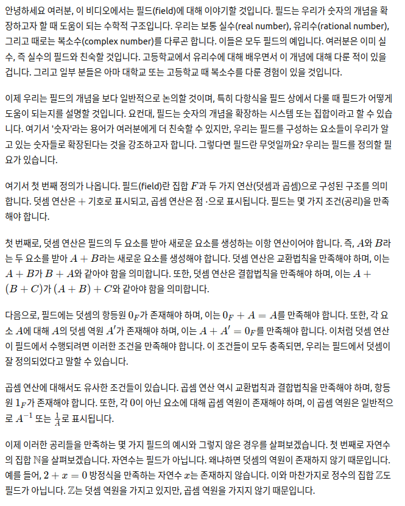

안녕하세요 여러분, 이 비디오에서는 필드(field)에 대해 이야기할 것입니다. 필드는 우리가 숫자의 개념을 확장하고자 할 때 도움이 되는 수학적 구조입니다. 우리는 보통 실수(real number), 유리수(rational number), 그리고 때로는 복소수(complex number)를 다루곤 합니다. 이들은 모두 필드의 예입니다. 여러분은 이미 실수, 즉 실수의 필드와 친숙할 것입니다. 고등학교에서 유리수에 대해 배우면서 이 개념에 대해 다룬 적이 있을 겁니다. 그리고 일부 분들은 아마 대학교 또는 고등학교 때 복소수를 다룬 경험이 있을 것입니다.

이제 우리는 필드의 개념을 보다 일반적으로 논의할 것이며, 특히 다항식을 필드 상에서 다룰 때 필드가 어떻게 도움이 되는지를 설명할 것입니다. 요컨대, 필드는 숫자의 개념을 확장하는 시스템 또는 집합이라고 할 수 있습니다. 여기서 '숫자'라는 용어가 여러분에게 더 친숙할 수 있지만, 우리는 필드를 구성하는 요소들이 우리가 알고 있는 숫자들로 확장된다는 것을 강조하고자 합니다. 그렇다면 필드란 무엇일까요? 우리는 필드를 정의할 필요가 있습니다.

여기서 첫 번째 정의가 나옵니다. 필드(field)란 집합 \( F \)과 두 가지 연산(덧셈과 곱셈)으로 구성된 구조를 의미합니다. 덧셈 연산은 \( + \) 기호로 표시되고, 곱셈 연산은 점 \( \cdot \)으로 표시됩니다. 필드는 몇 가지 조건(공리)을 만족해야 합니다.

첫 번째로, 덧셈 연산은 필드의 두 요소를 받아 새로운 요소를 생성하는 이항 연산이어야 합니다. 즉, \( A \)와 \( B \)라는 두 요소를 받아 \( A + B \)라는 새로운 요소를 생성해야 합니다. 덧셈 연산은 교환법칙을 만족해야 하며, 이는 \( A + B \)가 \( B + A \)와 같아야 함을 의미합니다. 또한, 덧셈 연산은 결합법칙을 만족해야 하며, 이는 \( A + (B + C) \)가 \( (A + B) + C \)와 같아야 함을 의미합니다.

다음으로, 필드에는 덧셈의 항등원 \( 0_F \)가 존재해야 하며, 이는 \( 0_F + A = A \)를 만족해야 합니다. 또한, 각 요소 \( A \)에 대해 \( A \)의 덧셈 역원 \( A' \)가 존재해야 하며, 이는 \( A + A' = 0_F \)를 만족해야 합니다. 이처럼 덧셈 연산이 필드에서 수행되려면 이러한 조건을 만족해야 합니다. 이 조건들이 모두 충족되면, 우리는 필드에서 덧셈이 잘 정의되었다고 말할 수 있습니다.

곱셈 연산에 대해서도 유사한 조건들이 있습니다. 곱셈 연산 역시 교환법칙과 결합법칙을 만족해야 하며, 항등원 \( 1_F \)가 존재해야 합니다. 또한, 각 \( 0 \)이 아닌 요소에 대해 곱셈 역원이 존재해야 하며, 이 곱셈 역원은 일반적으로 \( A^{-1} \) 또는 \( \frac{1}{A} \)로 표시됩니다.

이제 이러한 공리들을 만족하는 몇 가지 필드의 예시와 그렇지 않은 경우를 살펴보겠습니다. 첫 번째로 자연수의 집합 \( \mathbb{N} \)을 살펴보겠습니다. 자연수는 필드가 아닙니다. 왜냐하면 덧셈의 역원이 존재하지 않기 때문입니다. 예를 들어, \( 2 + x = 0 \) 방정식을 만족하는 자연수 \( x \)는 존재하지 않습니다. 이와 마찬가지로 정수의 집합 \( \mathbb{Z} \)도 필드가 아닙니다. \( \mathbb{Z} \)는 덧셈 역원을 가지고 있지만, 곱셈 역원을 가지지 않기 때문입니다.

하지만 유리수의 집합 \( \mathbb{Q} \)는 필드입니다. 왜냐하면 덧셈과 곱셈에 대해 항등원과 역원을 모두 가지기 때문입니다. 실수의 집합 \( \mathbb{R} \)과 복소수의 집합 \( \mathbb{C} \)도 필드의 예입니다.

이제 필드의 개념을 이해했으니, 필드 간의 관계를 나타내는 필드 사상(field morphism)에 대해 논의해 보겠습니다. 필드 사상이란 필드 간의 함수를 말하며, 이 함수는 덧셈과 곱셈에 대해 보존적이어야 합니다. 필드 사상은 항상 단사 함수가 되며, 이는 두 필드의 구조가 매우 밀접하게 관련되어 있음을 의미합니다.

마지막으로, 유한 필드(finite field)에 대해 알아보겠습니다. 유한 필드란 유한한 수의 요소를 가진 필드입니다. 이를 구성하기 위해 우리는 정수의 집합 \( \mathbb{Z} \)에서 특정한 모듈로 연산을 정의하여 유한한 집합을 생성할 수 있습니다. 예를 들어, \( \mathbb{Z}/p\mathbb{Z} \)는 소수 \( p \)에 대해 유한 필드를 형성합니다. 이러한 유한 필드는 많은 수학적 응용에서 중요한 역할을 합니다.

이 비디오에서는 필드의 기본 개념과 몇 가지 예제에 대해 논의했습니다. 다음 비디오에서는 필드의 더 심화된 주제들, 특히 유한 필드와 그 응용에 대해 논의할 것입니다. 함께 공부해 주셔서 감사합니다. 다음 비디오에서 뵙겠습니다. 안녕히 계세요.

