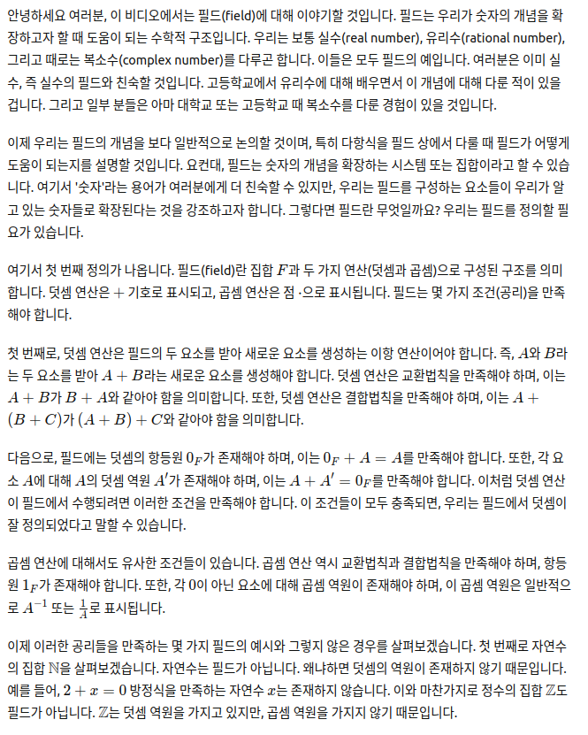
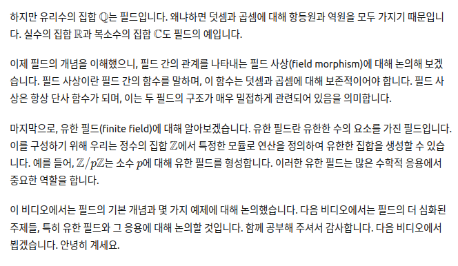

# FINITE FIELDS

## 한글:

안녕하세요 여러분, 이 비디오에서는 필드(field)에 대해 이야기할 것입니다. 필드는 우리가 숫자의 개념을 확장하고자 할 때 도움이 되는 수학적 구조입니다. 우리는 보통 실수(real number), 유리수(rational number), 그리고 때로는 복소수(complex number)를 다루곤 합니다. 이들은 모두 필드의 예입니다. 여러분은 이미 실수, 즉 실수의 필드와 친숙할 것입니다. 고등학교에서 유리수에 대해 배우면서 이 개념에 대해 다룬 적이 있을 겁니다. 그리고 일부 분들은 아마 대학교 또는 고등학교 때 복소수를 다룬 경험이 있을 것입니다.

이제 우리는 필드의 개념을 보다 일반적으로 논의할 것이며, 특히 다항식을 필드 상에서 다룰 때 필드가 어떻게 도움이 되는지를 설명할 것입니다. 요컨대, 필드는 숫자의 개념을 확장하는 시스템 또는 집합이라고 할 수 있습니다. 여기서 '숫자'라는 용어가 여러분에게 더 친숙할 수 있지만, 우리는 필드를 구성하는 요소들이 우리가 알고 있는 숫자들로 확장된다는 것을 강조하고자 합니다. 그렇다면 필드란 무엇일까요? 우리는 필드를 정의할 필요가 있습니다.

여기서 첫 번째 정의가 나옵니다. 필드(field)란 집합 \( F \)과 두 가지 연산(덧셈과 곱셈)으로 구성된 구조를 의미합니다. 덧셈 연산은 \( + \) 기호로 표시되고, 곱셈 연산은 점 \( \cdot \)으로 표시됩니다. 필드는 몇 가지 조건(공리)을 만족해야 합니다.

첫 번째로, 덧셈 연산은 필드의 두 요소를 받아 새로운 요소를 생성하는 이항 연산이어야 합니다. 즉, \( A \)와 \( B \)라는 두 요소를 받아 \( A + B \)라는 새로운 요소를 생성해야 합니다. 덧셈 연산은 교환법칙을 만족해야 하며, 이는 \( A + B \)가 \( B + A \)와 같아야 함을 의미합니다. 또한, 덧셈 연산은 결합법칙을 만족해야 하며, 이는 \( A + (B + C) \)가 \( (A + B) + C \)와 같아야 함을 의미합니다.

다음으로, 필드에는 덧셈의 항등원 \( 0_F \)가 존재해야 하며, 이는 \( 0_F + A = A \)를 만족해야 합니다. 또한, 각 요소 \( A \)에 대해 \( A \)의 덧셈 역원 \( A' \)가 존재해야 하며, 이는 \( A + A' = 0_F \)를 만족해야 합니다. 이처럼 덧셈 연산이 필드에서 수행되려면 이러한 조건을 만족해야 합니다. 이 조건들이 모두 충족되면, 우리는 필드에서 덧셈이 잘 정의되었다고 말할 수 있습니다.

곱셈 연산에 대해서도 유사한 조건들이 있습니다. 곱셈 연산 역시 교환법칙과 결합법칙을 만족해야 하며, 항등원 \( 1_F \)가 존재해야 합니다. 또한, 각 \( 0 \)이 아닌 요소에 대해 곱셈 역원이 존재해야 하며, 이 곱셈 역원은 일반적으로 \( A^{-1} \) 또는 \( \frac{1}{A} \)로 표시됩니다.

이제 이러한 공리들을 만족하는 몇 가지 필드의 예시와 그렇지 않은 경우를 살펴보겠습니다. 첫 번째로 자연수의 집합 \( \mathbb{N} \)을 살펴보겠습니다. 자연수는 필드가 아닙니다. 왜냐하면 덧셈의 역원이 존재하지 않기 때문입니다. 예를 들어, \( 2 + x = 0 \) 방정식을 만족하는 자연수 \( x \)는 존재하지 않습니다. 이와 마찬가지로 정수의 집합 \( \mathbb{Z} \)도 필드가 아닙니다. \( \mathbb{Z} \)는 덧셈 역원을 가지고 있지만, 곱셈 역원을 가지지 않기 때문입니다.

하지만 유리수의 집합 \( \mathbb{Q} \)는 필드입니다. 왜냐하면 덧셈과 곱셈에 대해 항등원과 역원을 모두 가지기 때문입니다. 실수의 집합 \( \mathbb{R} \)과 복소수의 집합 \( \mathbb{C} \)도 필드의 예입니다.

이제 필드의 개념을 이해했으니, 필드 간의 관계를 나타내는 필드 사상(field morphism)에 대해 논의해 보겠습니다. 필드 사상이란 필드 간의 함수를 말하며, 이 함수는 덧셈과 곱셈에 대해 보존적이어야 합니다. 필드 사상은 항상 단사 함수가 되며, 이는 두 필드의 구조가 매우 밀접하게 관련되어 있음을 의미합니다.

마지막으로, 유한 필드(finite field)에 대해 알아보겠습니다. 유한 필드란 유한한 수의 요소를 가진 필드입니다. 이를 구성하기 위해 우리는 정수의 집합 \( \mathbb{Z} \)에서 특정한 모듈로 연산을 정의하여 유한한 집합을 생성할 수 있습니다. 예를 들어, \( \mathbb{Z}/p\mathbb{Z} \)는 소수 \( p \)에 대해 유한 필드를 형성합니다. 이러한 유한 필드는 많은 수학적 응용에서 중요한 역할을 합니다.

이 비디오에서는 필드의 기본 개념과 몇 가지 예제에 대해 논의했습니다. 다음 비디오에서는 필드의 더 심화된 주제들, 특히 유한 필드와 그 응용에 대해 논의할 것입니다. 함께 공부해 주셔서 감사합니다. 다음 비디오에서 뵙겠습니다. 안녕히 계세요.

## 영문 :

Introduction
so hello everybody uh in this video we're going to talk about fields
um a field is a mathematical structure that comes in help when we want to
um extend the notion of numbers right we
are used to work with uh real numbers
rational numbers and maybe sometimes complex numbers these are examples
of fields I'm sure you've already worked with r
the field of the real numbers uh also when you were in high school I'm
sure you uh talked a little bit about fractions so you know what the rational
numbers are and some of you maybe uh experience some worked
with complex numbers maybe when you were in college or maybe even in high school
so we're going to discuss the notion of field in a more General
fashion and we're going to explain how Fields work and help us especially when
we want to refine polynomials over a field so
more or less what we want to say is that a field is a set of numbers
or a system of numbers
maybe number is a more familiar term for all of you but
we want to emphasize that we are extending the notion of number uh
to to a field right so elements of a field are what we used to know as
numbers so what is a field anyway we need to Define what a field is right so uh here
comes the first definition field
is a set f
together
with two operations
called addition
that we're going to note with a plus sign
and multiplication
note that with the DOT right
search that so a field book must
satisfy a certain group of conditions of axioms in order to
to work so um first of all uh
the operation Plus
takes two elements of the field and produces a new one right
so this is what we call a binary operation that takes the pair AV and
produces a new element called A Plus
see this is the new number A plus b
uh this operation Plus or addition has to be um commutative
this means that a plus B has to be the same as B plus a
then at least three Association so creative
so a plus b plus plus C equals a plus b plus C so we're going to write this down
right so this means that a plus B has to be
the same as B plus a for every and F
then association means that a plus b plus C has to be the same as a
plus b plus c right another thing we're going to uh
ask for this operation is that uh there exists
element 0 sub f
such that zeros of f plus a is the same as a plus
zero sub f and this is a for every a and F
right obviously this element has to play the role as a neutral element for addition
right so that is zeros of f is like the zero number it's like this zero element
and also for
um each element of the field
it's a writer like this
for e a long 12.
there's and element a prime also I have
such that
a plus a prime equals a prime plus a and
this is zero so f
uh a prime is uh known
as the um additive
inverse four a
right so this is like the first set of things that we need uh uh the operation
plus to satisfy in order to have a field obviously this operation that is noted
with a plus sign is actually mimicking all what the addition what the ordinary
addition of numbers uh does so we are relying on the same symbol
just to fix ourselves to the idea that adding elements of a field is just like
adding numbers even if there are not numbers okay it's like a reminder that
this operation works just as we know addition works
right so these are four um axioms Define
addition on on F uh we will have another video
um going deeper into this sort of binary operation if we just consider F and this operation
what we have is an a billion group that structure is a very interesting one
appears in all mathematics and we're not going to spend more time than just a
definition here but it's a very fruitful structure and uh so we were saying that we have
addition and we also have multiplication we're going to speak
some things about multiplication now so two
the uh multi application
operation so it's denote denoted with a DOT and
it's also a binary operation that that means we take two elements of F and we
construct a different for f so if we take the pair a b we
produce the pair a times B so we're going to ask this operation to
have certain properties and pretty much in the same fashion that we did with the addition right
right so we have number five dot is a community
and six dot is associated
that means that a times B is the same as B times a for
every a b and F and this means that
a times B times C has to be the same as
a times B times C it's also for all a b C and
right so this operation uh actually a commutative and Associated
right right then we're going to ask for the existence of a very special element for
the field that um has the following property there is
element e belonging to f
such that e times a equals a times E
equals a so this element e
works as a neutral element for multiplication
so we say that the
the true element
for multiplication right it works just as if
it were a one okay and we have to ask
and he has a bit different
from the zero element
so this prevents the trivial cases for Rings we're going
to work with links where the neutral elements for plus and
multiplication are different this sounds like a very technical
uh assumption and it is it is a technical assumption but
saves us a couple of headaches in the future this is what we would ask for anyway
so there's an element that works as one and um
we're going to ask for some more things
uh
what do we have now we can distribute addition and
multiplication right so we're going to say a times B plus c
has to be the same as a Time speed plus eight times so we can distribute
multiplication in terms of addition so there's a final condition that we're
going to impose on this multiplication operation that's going to ensure us that
we have all the properties that we need number nine
um each a
F that is not zero
has a multiplicative
inverse that is there exists
a hat such that a times
a hat the same as it had a and this is
D multiplicative uh neutral development so what this means is that each number
that is non-zero can be inverted in in that field
uh usually
inverse is noted a to the power of minus one also 1 over a
so this is notation
for uh applicative
inverse so
all these conditions or axioms are what are defined a few
field it feels except bundle with two operations called additional multiplication subject
to all these nine conditions okay
once we set the definition we're going to show some examples and some
non-examples as well so do that now
examples and
non-examples
so let's start with a non-example
the set of natural numbers so the natural numbers set one two three four and so on or
these are the numbers that we use to count right we learn about these
numbers in kindergarten so when you see why is it that end
natural numbers is not a field well for a number of
reasons but we can say that n is
a field
because there are elements
in n that have no
additive inverse
well as a matter of fact none of them have additive numbers
yeah two has no inverse
respect to addition
in yeah you know that is um
we can say that like there is no solution
to the equation 2 plus X
equal zero
right there's not even a zero so and it's not a field because it has
no zero element Specter Edition additive inverses for speculation
so and it's not a field say that we are now interested in
looking at Z
make the whole numbers
also known as integers well Z consists of all the natural
numbers added with um zero and the negative numbers so
three minus two minus one zero and then all the naturals
right so now we have fixed this thing of
not having the inverses because now each number has
additive inverse say three plus minus three is
actually 0 and this happens for every number
here and for each element of C there's an additive inverse
but um what lacks is multiplicative inverses
that is the equation
2 times x equals one
has no solution
set so the natural numbers
are for are not a field they do not form a field because we don't have a an
additive neutral element see
has all the inverses has a neutral element which is zero but has no multiplicative inverses
so cannot be a field well
there's a field that we can form and we know this field for a long time
it's Q the field of rational numbers
right and this accounts for these little fractions right so it's
compulsive symbols noted A over B such that a is in C and B is a natural number
right so rational numbers do have inverses
for both additional multiplication and they work just fine for most
purposes right and also
we have a bigger field that contains Q if you will set up real numbers
so the real numbers include the rational numbers are special cases
and also um limits of sequences of rational numbers
if you don't know what a sequence is just don't worry we're going to cover that in a separate video but what we
want to show here is that we have this sort of chain of containments
Containments
and we started with national numbers then adding the additive inverses and zero we
get a integers and when we add the
multiplicative inverses we get Q okay so adding now limits of sequences
of rational numbers we got are real numbers
so here we have lots of things work with and also if
you think a little bit more this is contained in certain complex numbers
yeah search as examples but we're not going to concentrate on the nature of Q and C and R and
we're going to discuss the properties of fields themselves right
we're going to go a little bit more structural at this
Fieldmorphisms
stuff so next thing we are going to talk about are field
morphisms so
let F and
l the uh two fields
so definition and a field on morphism
f l
is a function such that
it's compatible with addition
F of the addition is actually the addition of the images
then have multiplication is the multiplication of
the images right and what we have is that we needed to
send the serial element of f to the zero element
l right
also the neutral element of f for uh
multiplication has to go to the zero element the neutral element
of multiplication for l
so this is what we are asking when we're talking about field morphisms
her functions then transform uh elements of one field into elements of a
different field it's not difficult to show that whenever
we have this sort of function this is an injective function
that is two different elements of f end up Landing in two different elements
of L right so there are no two distinct elements from the field f
that correspond to a single element of L right
this is important because field morphisms allow us to view f as a proper
subset of L observation
and field lessons
are injected
if you don't remember what injective means just don't worry we're going to have a different video talking about functions we're going to just explain
that in more detail so f
of the field F like the image of f can be seen
as a subset of field L right so this is a very uh restrictive
condition okay this is a very very restrictive
condition for a function to be a field Marshal amorphism
well there are some things that
that can be said about this sort of functions and the good thing is that
whenever we can work with a field morphism
we're going to have lots of operations that can be performed within l or within f
so this is some sort of mechanism to send operations that are done in F
and we're going to make this more explicit when we talk about this next topic which is final fields
now this is a very important topic a final field is a field which has
Finite Fields
finally many elements right
how do we work
with finite fields
can we show any final field at all
well um we're going to spend the rest of this
video trying to construct a finite field and once we Define what uh what what it
is and can be achieved to have a final field uh we're going to show that um
that is a very useful Construction right so how do we come about finding things
so let's start
with C C is
not a field right
because it lacks
applicative inverses
so a field that lacks duplicative inverses is called a
commutative ring
a commutative
ring addition is commutative multiplication
is also commutative everything distributes nicely Associates nicely but
some elements do not have multiplicative inverses so that's what's
been lacking we lack of that sort of property
what is a possible thing we can do with C well
let's fix an element
say it's greater than one right
we can Define
a equivalence
relation in C
um by setting the following rule
will say that B is related to a according to n if and
only if B minus a
is a multiple of n
this can also be stated as B minus a is
divisible by n
so there exists k you see such that B minus a has formed
so this relation under this definition
defines what we we call a equivalence relation
and the equivalence
class of a an element
x and z we we shall note it like X bar
is the set of all things instead such that a is related
with x right
and we're going to work nothing set but the equivalence
collection now we'll we will form a set made up of equivalence classes
will look at the collection
of equivalence classes
of this relation
and we're going to note it said
over this relationship
since this is sometimes through cumbersome to your right we are going to
use this notation set Sub in
do we have numbers here we have sets
those sets are exactly the equivalence classes of numbers
okay and there's an advantage
originally observation
said is an infinite set
it has infinite many elements one two three four five etc etc it's an
infinite set when we look at the uh equivalence classes
we see that Z sub N is a finite set
right so the operation of looking at Z
with this special sort of glasses that allow us to look at
equivalence classes we just see finitely many elements so why
so if you take a look at zero the equivalence class of zero consists of
zero and two times n three times n
minus n minus two times n minus three times n
Etc so if you take a look at the equivalence class of one
have one you have n plus one you have two n
is one you have three n is one etc etc
if you take a look at the equivalence class for two so we
have two n plus two two n plus two and so on
so the thing is that if you start doing this with all the
integers the last one that you see that's different from the previous ones is
the equivalence class for n plus one which is n minus one
then you have 2N D minus one then you have three n minus
one and so on so the collection
of all classes is actually the collection of the equivalence classes
from here to here in other words
the collection of classes is the class of 0 class of one class of two
all the way to class of n minus one if I wanted to look at the class of n it
will coincide with this one right so
set C sub n is a final set
right so with the help of the equivalence class we were able to transform this infinite
set into a final one but this is done in a very specific way
Addition and Multiplication
because they said admits addition and multiplication
operations sad and means
petition and multiplication
operations so how do we do that
how do we Define
addition and a multiplication
well it's not complicated say you want to add the class of a
and the class B okay how should we do this so we're
going to Define this as the class of a plus b
and I are going to define the multiplication of equivalence classes
well we're going to define it a times 3 and then we take classes
so it should be noted that this addition right here is addition
that is performed in sets when
this multiplication is also performed in this set
on the other hand this addition this multiplication
these operations are performed
in the so this Edition and this multiplication
are performed in a different place so graphically what we have we have zinc
which is our base set and then we have the set of the
equivalence classes set seven there's a way of assigning
a number to its corresponding class and this assignment is called the projection
operation by right so
this relation between the original set and the set of equivalence classes is
called a production so what happens is that first of all
these operations are well defined observation
Plus and multiplication
in Samsung n are well defined
that we can prove that this is well done we can
do that in a minute and also observation two
uh the projection
um is compatible
with the ring operations
that is this definition that we have written here
has the following consequence if we want to protect a plus b what we
get is the projection of a plus the projection B and also
the protection of the multiplication is the multiplication of the protections
that is pi results
a morphism
of ranks right
so we are sending a ring that's Z that's the original one
and we're going we're cramming it into a very small place that is also a ring
because of these definitions and it's and it's well definedness basically
so this is a a very easy thing to prove and we can leave this for viewer it's a
very nice exercise but what's mean it means that whenever I
want to add the class of a and the class of B here I can place any member of the
equivalence class of a and here I can place any member of the equivalence Class B and the result is
that is to prove that it's well defined but in the
Report with that's C
and using a an equivalence relation we find a final set
set of the equivalence classes that can be endowed with addition and
multiplication in the way that it becomes also a ring
and the thing is and this is
important observation theorem
cell C sub n is a field
if and only if
N is a prime
right and this is actually a very interesting
thing because equivalence relations in general do not yield
the only time when that happens is when the equivalence relation is to to look
at numbers modulo a prime so examples
set two three
five all these
are finite fields
so just to be explicit this is a class of
zero and the class of one is a field of two elements
C is a three zero one and two this is a field of three elements
C sub five so we have the class of 0 plus of one plus two
plus three and plus four is a field of five elements in general
for prime p send sub p is a field
of P elements
we're going to discuss this topic more deeply in
upcoming video where we're going to devote ourselves with the study of these rings and these
fields we're going to show some difference
C sub 3 and C is of four for instance we're going to compare a ring and a field and we're going to show
why do we need to have a prime number defining the equivalence relation
so there are five fields we can construct them using equivalence relations we're
going to show in the next video uh how we can visualize find fields and how
we can actually build a more complicated fields
and also recurring to polynomials right so
um I think we're going to stop for now we have several directions to go from
here we can take a look at functions
we can take a look at equivalence relations we can take a look at
how finding Fields work and maybe dive a little bit into the abl Pavilion group
concept which is going to pop up several times
within the same conversation and this is it for now I guess
in the next video we're going to dive a little bit deeper into this and it's going to be a lot of fun
so I hope you enjoyed this video you can just take a look at it
times you want and we'll see you in the next one okay goodbye

## 원본 링크 : https://www.youtube.com/watch?v=MAhmV_omOwA&list=PLFX2cij7c2PynTNWDBzmzaD6ij170ILbQ&index=11
