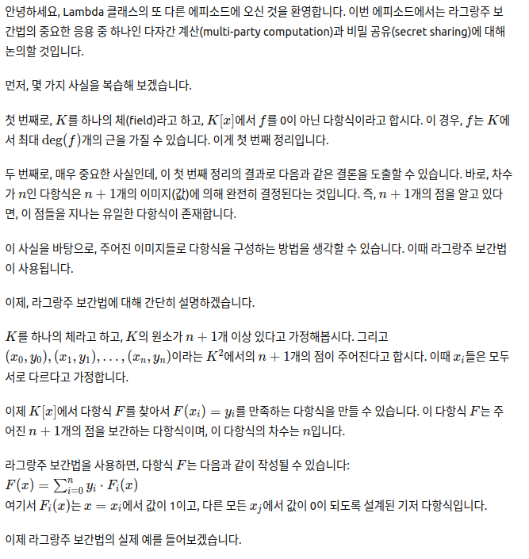
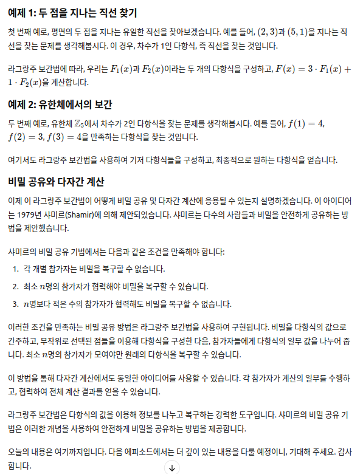

# Secret sharing and multiparty computation via Lagrange interpolation

## 한글:

안녕하세요, Lambda 클래스의 또 다른 에피소드에 오신 것을 환영합니다. 이번 에피소드에서는 라그랑주 보간법의 중요한 응용 중 하나인 다자간 계산(multi-party computation)과 비밀 공유(secret sharing)에 대해 논의할 것입니다.

먼저, 몇 가지 사실을 복습해 보겠습니다.

첫 번째로, \( K \)를 하나의 체(field)라고 하고, \( K[x] \)에서 \( f \)를 0이 아닌 다항식이라고 합시다. 이 경우, \( f \)는 \( K \)에서 최대 \( \text{deg}(f) \)개의 근을 가질 수 있습니다. 이게 첫 번째 정리입니다.

두 번째로, 매우 중요한 사실인데, 이 첫 번째 정리의 결과로 다음과 같은 결론을 도출할 수 있습니다. 바로, 차수가 \( n \)인 다항식은 \( n + 1 \)개의 이미지(값)에 의해 완전히 결정된다는 것입니다. 즉, \( n + 1 \)개의 점을 알고 있다면, 이 점들을 지나는 유일한 다항식이 존재합니다.

이 사실을 바탕으로, 주어진 이미지들로 다항식을 구성하는 방법을 생각할 수 있습니다. 이때 라그랑주 보간법이 사용됩니다.

이제, 라그랑주 보간법에 대해 간단히 설명하겠습니다.

\( K \)를 하나의 체라고 하고, \( K \)의 원소가 \( n + 1 \)개 이상 있다고 가정해봅시다. 그리고 \( (x_0, y_0), (x_1, y_1), \dots, (x_n, y_n) \)이라는 \( K^2 \)에서의 \( n + 1 \)개의 점이 주어진다고 합시다. 이때 \( x_i \)들은 모두 서로 다르다고 가정합니다.

이제 \( K[x] \)에서 다항식 \( F \)를 찾아서 \( F(x_i) = y_i \)를 만족하는 다항식을 만들 수 있습니다. 이 다항식 \( F \)는 주어진 \( n + 1 \)개의 점을 보간하는 다항식이며, 이 다항식의 차수는 \( n \)입니다.

라그랑주 보간법을 사용하면, 다항식 \( F \)는 다음과 같이 작성될 수 있습니다:
\[ F(x) = \sum\_{i=0}^{n} y_i \cdot F_i(x) \]
여기서 \( F_i(x) \)는 \( x = x_i \)에서 값이 1이고, 다른 모든 \( x_j \)에서 값이 0이 되도록 설계된 기저 다항식입니다.

이제 라그랑주 보간법의 실제 예를 들어보겠습니다.

### 예제 1: 두 점을 지나는 직선 찾기

첫 번째 예로, 평면의 두 점을 지나는 유일한 직선을 찾아보겠습니다. 예를 들어, \( (2, 3) \)과 \( (5, 1) \)을 지나는 직선을 찾는 문제를 생각해봅시다. 이 경우, 차수가 1인 다항식, 즉 직선을 찾는 것입니다.

라그랑주 보간법에 따라, 우리는 \( F_1(x) \)과 \( F_2(x) \)이라는 두 개의 다항식을 구성하고, \( F(x) = 3 \cdot F_1(x) + 1 \cdot F_2(x) \)을 계산합니다.

### 예제 2: 유한체에서의 보간

두 번째 예로, 유한체 \( \mathbb{Z}\_5 \)에서 차수가 2인 다항식을 찾는 문제를 생각해봅시다. 예를 들어, \( f(1) = 4 \), \( f(2) = 3 \), \( f(3) = 4 \)을 만족하는 다항식을 찾는 것입니다.

여기서도 라그랑주 보간법을 사용하여 기저 다항식들을 구성하고, 최종적으로 원하는 다항식을 얻습니다.

### 비밀 공유와 다자간 계산

이제 이 라그랑주 보간법이 어떻게 비밀 공유 및 다자간 계산에 응용될 수 있는지 설명하겠습니다. 이 아이디어는 1979년 샤미르(Shamir)에 의해 제안되었습니다. 샤미르는 다수의 사람들과 비밀을 안전하게 공유하는 방법을 제안했습니다.

샤미르의 비밀 공유 기법에서는 다음과 같은 조건을 만족해야 합니다:

1. 각 개별 참가자는 비밀을 복구할 수 없습니다.
2. 최소 \( n \)명의 참가자가 협력해야 비밀을 복구할 수 있습니다.
3. \( n \)명보다 적은 수의 참가자가 협력해도 비밀을 복구할 수 없습니다.

이러한 조건을 만족하는 비밀 공유 방법은 라그랑주 보간법을 사용하여 구현됩니다. 비밀을 다항식의 값으로 간주하고, 무작위로 선택된 점들을 이용해 다항식을 구성한 다음, 참가자들에게 다항식의 일부 값을 나누어 줍니다. 최소 \( n \)명의 참가자가 모여야만 원래의 다항식을 복구할 수 있습니다.

이 방법을 통해 다자간 계산에서도 동일한 아이디어를 사용할 수 있습니다. 각 참가자가 계산의 일부를 수행하고, 협력하여 전체 계산 결과를 얻을 수 있습니다.

라그랑주 보간법은 다항식의 값을 이용해 정보를 나누고 복구하는 강력한 도구입니다. 샤미르의 비밀 공유 기법은 이러한 개념을 사용하여 안전하게 비밀을 공유하는 방법을 제공합니다.

오늘의 내용은 여기까지입니다. 다음 에피소드에서는 더 깊이 있는 내용을 다룰 예정이니, 기대해 주세요. 감사합니다.

## ChatGPT 스크린샷

## 영문 :

to another episode of mathematics in Lambda class in this episode we're going
to discuss an important application of LaGrange interpolation which is a multi-party
computation and secret sharing okay so let's recall some facts
Let's uh recall
first of all um let k
be a field and let's take a polynomial
in K of x uh and let's say
f is non-zero then F has at most
uh degree of f roots
in k so this is our first fact Earth theorem
okay if we take a non-zero polynomial of degree n then F has at most n roots in
game
second of all and this is very important as well this is a
corollary of the first theorem that we have and it is
um a polynomial
of a degree n
is completely determined
by M plus one of its images
okay so a degree M polynomial ends up being completely determined by M plus
one values that is if I have M plus 1 points then
there exists a unique polynomial that goes through those points
so this is a very important relation okay the degree of n
and how many points do I need to completely specify it
okay and this in turn led to uh the discussion uh
how to build a polynomial polynomial with a prescribed images
and that's what we discussed when we talked about LaGrange interpolation
okay we're talking about leg range interpolation so let KV a feel
and let's suppose for the time being that the number of elements of K
is uh greater than M plus one just for the time being this is not really that
important and also let
um the collections
x sub i y sub I for zero
less or equal to y less or equal to n
a collection of all points
in K squared okay such that
the first coordinates are all different
okay uh then uh there exists
a polynomial
F in K of x such that F applied to X of Y is X of I
equals y sub I okay we say that f interpolates
the N plus one points
x i y sub y and with the important distinction that
the degree of f is n so if you give me M plus 1 points in K
squared I can find a polynomial of the green n that interpolates those n plus 1
points okay and this polynomial is built
um in a number of ways but we're going to concentrate in a very specific way of
building f that is
using LaGrange interpolation
that is polynomial f can be written as a sun
from I equal to 0 to n y sub I
F sub i x where this polynomials F sub I
take the value of one for x equal to x sub I and take the value 0 for X different from X of I
so a in this way the uh observation
the polynomials F sub I of X behave
like the canonical vectors the canonical
basis in our so your polynomials that take the value
1 add a specific point and then 0 for all the other ones
and uh the only secret is how to build
where the F sub F sub I the basis
polynomials so to speak are constructed
using the starting
great so we can build this basis polynomials taking first of
all the product of X of Y minus x sub J for uh J different
why this is a constant okay
and we're going to invert this constant and then we have the
product K different from I x minus
so this is the recipe for constructing the basis polynomials
observation is that we are working with a field okay
field and the x is different
imply that this subtractions are non-zero
so since they are non-zero in a field they can be inverted
so they say this is a well-defined element of K this is well defined
so we had uh done this in the past and we have written the basis
polynomials in a very formal fashion um this LaGrange interpolation
polynomial is unique and the polynomial with minimal degree
that interplays this M plus one points okay so to get to have an idea of
uh to see how it works we'll make two very very easy examples
um example one
example one and uh this will ring a bell surely for
many of you there exists
a single line
through any two points
in the plane
okay this is going to go pretty much like that so let's start with
R2
and let's start with the starting grid that is choosing two points
it says uh to um
three and this one five let's say
five one so we start with the points two and three
and uh five one we want to interpolate these two points
we know that there's a single line that goes
through those points so this line is actually the graph of a degree one
polynomial graph of a degree
one polynomial okay so we need to find the equation of
that line okay so uh how does a LaGrange
interpolation work so since we have to interpolate two points we need two polynomials
F1 that will vanish
at five
and we'll take the value 1
at 2. and then we have uh the other one then
we have F2 it will vanish
at two and we'll take
the value 1 out of five okay
so the polynomial that we are going to build is actually uh
spelled with these numbers and these polynomials it's going to be 3 times F1
of x Plus 1 times F2 of x
this is the polynomial that we are looking for all we have to do is construct F1
and construct F2 all right so this is not complicated
because for F1 F1 of x
we are going to remember okay we need to take this constant
and multiply x minus
it has to buy this at five so x minus 5.
see this polynomial because of the way it is constructed will vanish at five if I replace the X
with a 5 I get Alpha times 5 minus 5 that's Alpha times 0. so F1
will vanish at five the only requisite that we have is that it will has to take the value one so we
need to choose Alpha so that
F1 at 2 equals to one
that's all we need Okay so one a two we'll have to return the value
one so there's Alpha times two minus five this one
so Alpha is actually one over two minus five and this is minus one
third so we have already constructed F1 of x
all right so we already have this one um four F2
F2 has to be written as a beta times x
minus 2. okay so uh it has to vanish at two and
it has to take the value one and five so F2 at five we'll have to take the value
one so that is beta times times five minus 2 equal to one
Theta has to be one third and this gives us F2 of x
as one-third times x minus
five minus two I'm sorry
so now that we have F1 and F2 all we need to do is
put them together and combine them so we get f
you said it was three times F1 this is three times minus one third
x minus five plus and we're adding now one
times 1 3 x minus two of course if we um
take all the multiplications we will get a degree one polynomial okay so this is
minus X Plus one third of X this is minus two-thirds
times x and then we have five uh minus two
thirds this is 13. thirds
and this is the polynomial that we're looking for if the calculations are right
this polynomial interpolates
to five and five
okay up to three I'm sorry
so this is the polynomial that we were looking for this construction of actually
um finding the basis polynomials
uh can be extended to many fields okay we have done an example with r of x
okay so in the second example we'll work with
um a finite field sample two
uh let's uh find F belonging to
set five of x of
degree two such that
okay um f of the class of one will equal to
four F of the class of two will equal to
three and if the class of say three equals to four
okay so let's find a polynomial with coefficients in in sets up five set five
okay uh solution uh let's recall okay let's uh
call that said five is actually the set of
reminders of dividing
by five so this is uh the collection of remainders
the operations that we take here are the usual ones class of M plus the class of n will be
the class of sum and also multiplication
is handled uh similarly we take the product and then we take classes
okay so whenever we want to combine these elements we need to use those
rules okay so let's uh let's start okay so we need
to um need to interpolate
three points so we need a degree to polynomial okay
uh points are plus of one and class of four class of two and class of three and then
class of three and class of four okay so we are going to um solve this problem
by saying okay the uh after we're looking for can be written as a sum it's
going to be the class of four times F1 of x
Plus uh the class of three
times F2 of x Plus
the class of four times F3 of x
and this is the polynomial that we're looking for once we compute F1 F2 and F3 we're done
okay so uh let's hear let's see how it works
again F1 of x is easily constructed it has to vanish
at two and three so x minus the class of 2 times x minus
the class of three this will guarantee that this polynomial will vanish exactly
at the glass of two and the class of three let me um
smaller space here well I just need to move it a little bit
further class of 2 times x minus the class of
three and then we need uh this polynomial to take the value one
when we evaluate it at the class of one so what we need to put here is a
normalizing constant it's going to be 1 minus uh the class of two
times one minus the class of three and we are going to invert this constant
this uh is well defined because all the um first components are different
so all these numbers are non-zero and since we're in a field we can invert that
so if you bear with me with computation this is the class of minus one times
plus of minus two inverted and then we have x minus the
plus of 2 times x minus the class of three this is just a class of two inverted
well it so happens that the class of two when we are inverted in set five is
actually the class of three and this is so because when we multiply these guys we get the class of six which
is actually uh one okay six has remainder one when we
divided by five so the class of two and the class of three are inverses
uh so what we get here is the class of three times this product
uh once we get this we just multiply out everything and we get a proper
polynomial squared minus uh class of five x
plus the class of six and now again class of five is actually equal to the
class of zero and this guy is actually the class of one so multiplying three we we get the class
of three x squared uh plus the class of three
this is the first polynomial that we were looking for first basis polynomial
okay for the second one it's pretty much the same
how do we think of F2 okay F sub 2 will have to vanish all right
but one and then it has to vanish at three okay so it is easy to construct
x minus the plus of one times x minus the class of three
and then it has to take the value 1 when we evaluate at the class of two
that's a two minus the plus one plus two minus plus a 3.
and then we invert if you bear with me with the computations this is the class of 1
times plus of minus one
okay the class of minus one is actually the class of four because
when we take minus one and we add five we get the class of four
so this is the inverse of the class of four
Plus One X minus the class of three so now we need to find the inverse of
the class of four and if you take a look this is the class of 16 which modulo 5
is actually one so 4 is its own inverse this is the class of four
all right and expanding the product what we get it's not a very complicated thing
it's a being class of four and not x squared minus 4 plus a 4X
plus the class of three minus the class of four
can be thought as the class of one
and then when we multiply everything out
four times three is twelve so that's the class of 2 multiple five
and this is second base is polynomial
finally
third it has to vanish at one and it has to manage a two all right so in set one
and two so this is now complicated x minus one x minus two in classes
and then it has to take the value one when we plug in the class of three
so it's it's still under being three minus one three minus two
and we'll invert this the class of two times the class of one we inverted
times x minus one x minus two and this will be just uh the inverse of the class
of two which is the class of three right now that and when expanding
this is what we get minus the class of three is actually the class of two
and uh multiply now class of three times x squared
the class of 1 times X plus the class of one
and this is the third polynomial that we were looking for all right
so the recipe is uh quite straightforward obviously there's there
are plenty of options of computing given a certain starting grid there are many
software options to build those polynomials and they are not complicated to you
to make Okay so lastly
we just uh plug everything plus a 4 times F1
plus a 3 times F2 the glass of four times
putting everything together
yields uh the desired polynomial
okay and this is a degree two polynomial that interpolates these three points
Okay so how do we use this
what's the use of actually doing LaGrange interpolation and um
this goes to secret sharing and multi
party uh computation
and this approach of this outlook for this problem uh came
from uh Shamir in 1979 he wrote a very beautiful paper
explaining how to share a secret with many parties in a very specific way
using LaGrange interpolation uh say agent
hey as a secret
and once to
shared but not in a very um
vague way we need to share the secret in a safe way
[Music] safe
manner with a many other ideas
so that the first condition uh
each agent on their own
cannot retrieve Secret
okay I'm gonna share pieces of information in such a way that each individual agent
cannot recover in secret uh Secret
uh will be unlocked
only when uh at least
an agents decide to cooperate
and no collection of
J lesson and agents
can retrieve Secret
okay so this is uh the protocol that a wants he wants to share a secret
with many people in the way in a way that individually those agents can't
retrieve the secret they need to cooperate to all to unlock the sequence
and they need to cooperate uh getting together at least n pieces of individual
information that they have okay so uh the way of doing this
goes back to uh Shamir and uh
the idea is quite simple and pretty astonishing so there's a protocol on how to do this
okay um suppose
they are the secret is
an element
it's an element
of a field k
um suppose furthermore
that the field decay has uh V elements and this is
greater than uh M plus one
and that we are requiring
n agents to cooperate
so the field that we need needs to have a more than M plus one elements
if we want to share the secret with n agents okay so this is what Shamir
devised um
let's take for instance then we have two copies of okay
this is just a scheme right and let's suppose that this point here
zero y 0 is the secret
that a wants to share
okay so the first step is uh
choose um random and random points
in K squared so Shamir says okay take uh
and more random points
this case n equals to four in this example
choose n random points in K squared the second step
is interpolate
those points using LaGrange
if the uh purple points are random then what we have is a random
polynomial interpolating
it's like P interpolating those uh n plus one points
the degree of p is actually n
okay and P interpolates
M plus one columns it is the only polynomial degree n that
actually does that and since this random points
were taken obviously randomly now P can be considered random
now we are going to hand out the information to the agents okay so what's
coming next is howdy how we distribute these shares of the secret okay uh
suppose we want
to hand out our pieces of information
so uh choose r
random uh elements non-zero elements of K
random non-zero
elements of K
and now we're gonna hand the pairs x sub r p evaluated at
XR to the Earth agent
okay so what we have now is that from the um
from the random polynomial all of the agent's C
okay let me copy this see if I can cut
let's let's do it again so from the uh random polynomial
and we have this was
uh zero comma y 0 and then we had something like this
in this random curve um at this point we had n equal to four
and let's say that we are um having six agents
okay so we need to take six uh random points
this curve and we're handing out uh
these pairs
so each agent uh by themselves they do not know which polynomial that point
belongs to say you have the sixth this is the the data that the sixth
agent yes all that this agency is is this point so he doesn't know if the
polynomial is a purple one or it's the light blue one the agent doesn't know
uh if he gets together with the fifth agent
between the two they don't know if they come from the polynomial purple of if
they come from the polynomial in pink okay they need exactly n agents to get
together in this case four agents need to cooperate to sort out p and when they have P they
can evaluate p at zero and they can retrieve um
the secret in this case
and agents
need to cooperate
and do LaGrange interpolation
again to recover
p and then take p at zero
so this is the big scheme of how we can share a secret with uh many agents okay
and um we were saying we're sharing a secret but we can
also divide a computation we can give many agents uh little pieces of a
computation and they can compute together an unknown result for each of them
okay so this is how LaGrange interpolation actually works
okay uh the magic of the polynomials the moral
story is the a polynomial
is an object that uh
is completely
determined by a finite set of constant find it set of constants
whether it's their coefficients or by using interpolation points but a
polynomial is defined by a finite set of constants
and at the same time
it defines a function
over a possibly
infinite set which is the base field
so to know a polynomial is to know
M plus one constants if we know M plus one constants we know a degree n
polynomial fully and not only that we know what value it
takes at an Infinity of other places
so a polynomial is a is a very useful object okay
the idea of interpolation and having partial information was also used by
Reed and Solomon because since a polynomial can be fully
recovered by M plus one points uh if we send a long list of values of a
polynomial we can recover the polynomial completely just by knowing n plus one
points so it doesn't matter if we lose some of those values
along the way if we can keep and we can keeply safe M plus 1 values we can recover all of the
polynomial okay so um the um
the place to go to is uh Shamir
so very important paper uh inferiorative information and it showcases a very
basic result of algebra and it uses it in a very elegant like
okay so I hope you enjoyed it and see you in the next one okay bye

## 원본 링크:

https://www.youtube.com/watch?v=3g4wZnhl4m8&list=PLFX2cij7c2PynTNWDBzmzaD6ij170ILbQ&index=3
