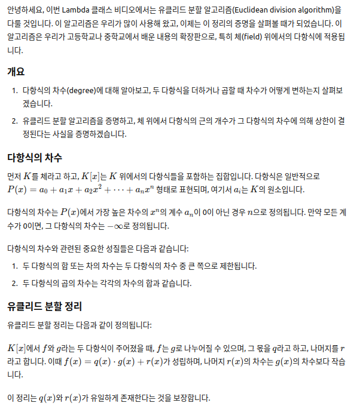
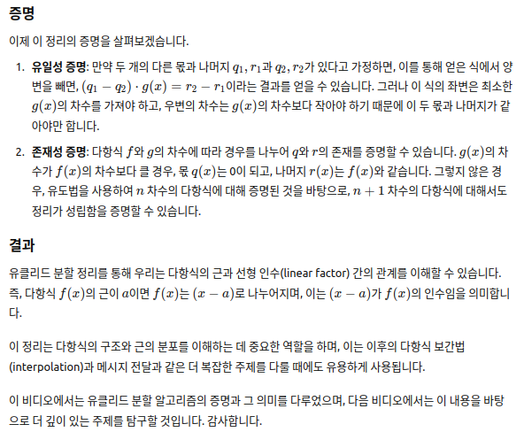

# Euclidean Division Explained

## 한글:

안녕하세요, 이번 Lambda 클래스 비디오에서는 유클리드 분할 알고리즘(Euclidean division algorithm)을 다룰 것입니다. 이 알고리즘은 우리가 많이 사용해 왔고, 이제는 이 정리의 증명을 살펴볼 때가 되었습니다. 이 알고리즘은 우리가 고등학교나 중학교에서 배운 내용의 확장판으로, 특히 체(field) 위에서의 다항식에 적용됩니다.

### 개요

1. 다항식의 차수(degree)에 대해 알아보고, 두 다항식을 더하거나 곱할 때 차수가 어떻게 변하는지 살펴보겠습니다.
2. 유클리드 분할 알고리즘을 증명하고, 체 위에서 다항식의 근의 개수가 그 다항식의 차수에 의해 상한이 결정된다는 사실을 증명하겠습니다.

### 다항식의 차수

먼저 \( K \)를 체라고 하고, \( K[x] \)는 \( K \) 위에서의 다항식들을 포함하는 집합입니다. 다항식은 일반적으로 \( P(x) = a_0 + a_1x + a_2x^2 + \dots + a_nx^n \) 형태로 표현되며, 여기서 \( a_i \)는 \( K \)의 원소입니다.

다항식의 차수는 \( P(x) \)에서 가장 높은 차수의 \( x^n \)의 계수 \( a_n \)이 0이 아닌 경우 \( n \)으로 정의됩니다. 만약 모든 계수가 0이면, 그 다항식의 차수는 \( -\infty \)로 정의됩니다.

다항식의 차수와 관련된 중요한 성질들은 다음과 같습니다:

1. 두 다항식의 합 또는 차의 차수는 두 다항식의 차수 중 큰 쪽으로 제한됩니다.
2. 두 다항식의 곱의 차수는 각각의 차수의 합과 같습니다.

### 유클리드 분할 정리

유클리드 분할 정리는 다음과 같이 정의됩니다:

\( K[x] \)에서 \( f \)와 \( g \)라는 두 다항식이 주어졌을 때, \( f \)는 \( g \)로 나누어질 수 있으며, 그 몫을 \( q \)라고 하고, 나머지를 \( r \)라고 합니다. 이때 \( f(x) = q(x) \cdot g(x) + r(x) \)가 성립하며, 나머지 \( r(x) \)의 차수는 \( g(x) \)의 차수보다 작습니다.

이 정리는 \( q(x) \)와 \( r(x) \)가 유일하게 존재한다는 것을 보장합니다.

### 증명

이제 이 정리의 증명을 살펴보겠습니다.

1. **유일성 증명**: 만약 두 개의 다른 몫과 나머지 \( q_1, r_1 \)과 \( q_2, r_2 \)가 있다고 가정하면, 이를 통해 얻은 식에서 양변을 빼면, \( (q_1 - q_2) \cdot g(x) = r_2 - r_1 \)이라는 결과를 얻을 수 있습니다. 그러나 이 식의 좌변은 최소한 \( g(x) \)의 차수를 가져야 하고, 우변의 차수는 \( g(x) \)의 차수보다 작아야 하기 때문에 이 두 몫과 나머지가 같아야만 합니다.

2. **존재성 증명**: 다항식 \( f \)와 \( g \)의 차수에 따라 경우를 나누어 \( q \)와 \( r \)의 존재를 증명할 수 있습니다. \( g(x) \)의 차수가 \( f(x) \)의 차수보다 클 경우, 몫 \( q(x) \)는 0이 되고, 나머지 \( r(x) \)는 \( f(x) \)와 같습니다. 그렇지 않은 경우, 유도법을 사용하여 \( n \) 차수의 다항식에 대해 증명된 것을 바탕으로, \( n+1 \) 차수의 다항식에 대해서도 정리가 성립함을 증명할 수 있습니다.

### 결과

유클리드 분할 정리를 통해 우리는 다항식의 근과 선형 인수(linear factor) 간의 관계를 이해할 수 있습니다. 즉, 다항식 \( f(x) \)의 근이 \( a \)이면 \( f(x) \)는 \( (x - a) \)로 나누어지며, 이는 \( (x - a) \)가 \( f(x) \)의 인수임을 의미합니다.

이 정리는 다항식의 구조와 근의 분포를 이해하는 데 중요한 역할을 하며, 이는 이후의 다항식 보간법(interpolation)과 메시지 전달과 같은 더 복잡한 주제를 다룰 때에도 유용하게 사용됩니다.

이 비디오에서는 유클리드 분할 알고리즘의 증명과 그 의미를 다루었으며, 다음 비디오에서는 이 내용을 바탕으로 더 깊이 있는 주제를 탐구할 것입니다. 감사합니다.

## ChatGPT 스크린샷

## 영문:

hahaha
hello welcome to another video for um Lambda class we're discussing
mathematics here and in this episode we're going to review
and the each ingredient division algorithm this is something that we have been
using quite a bit now so I think it's time to show a proof of that theorem
it's an extension of what we have done already in high school and middle school
but for polynomials over a field
um first of all we need to talk about the degree of a polynomial how it behaves when we multiply and add
two polynomials together we're then gonna discuss the proof of
the euclidean algorithm and then we're gonna show that for
polynomials over a field then the number of roots that that polynomial has over that field is bounded above by the
degree of the polynomial uh thing which is not true when we talk about polynomials over just
a ring okay um well so let's start we already know most
of these things so we're gonna go over them kind of quickly uh let K be a field
and consider the Ring of polynomials over that field
ring of polynomials
over k this is uh the set
of all the expressions of the form P of x
that are sums of coefficients in k
times x to the ith power set all the
AI belong to K and N is a natural number or zero okay
first observation big X is not
an element of K it is just a token it's just a
symbol that um we use in this notation
it's only a symbol
it interacts with the um self in this fashion every time we
multiply x to the eighth power times x to the J power we get
x to the I plus J power okay so we know how to add polynomials
and how to multiply them this
us to add and multiply
polynomials um
the uh the distributive
okay we're trying to formalize what we already know how to do so we just need
to say that well um there's uh this notion called the
degree of a polynomial okay which we can we
um we can think of it as a function that takes
a polynomial and gives us a number which is natural or zero
then it's going to be defined in this way so
defined by
if F of DX can be written as
this meaning that we can a Sub 0 plus a sub 1 times x
then a sub n times B of x to the nth power
then the degree of f is simply n okay
that's the degree of the polynomial
if the polynomial consists only of
zero coefficients then we will Define the degree of f as
minus infinity okay
so this allows
the following observation
first the degree of the sample or subtraction of two polynomials is bounded above by
the maximum of the degrees
because when we add two polynomials together maybe the powers of a higher
degree cancel out so in the end we we get a polynomial smaller degree
and second which is very important uh the degree of the product
is the sum of the degrees
so when we have two non-zero polynomials uh the degree that we get
is the sum of the degrees if
f g have
both non -zero degree
or positive degree
then the degree of f times
J is strictly greater than the degree of
f and strictly greater than the degree of
G and this is very important we're gonna use this today
so once we have talked about the degree it's time now to uh State the euclidean
theorem so let's um
euclidean division
theorem okay so let's State the theorem and then
we'll prove it and I will be happy with that so
let f and g to our polynomials over a field Loop k
where the r degree of f being n the degree of G being m
then their exist
unique polynomials Q
and r also K of x such that F can be written as
Q times G plus r with the important
Extinction that the degree of R has to be strictly
less than the degree of G this is a crucial condition for this
theorem to work okay
um this also allows R to be zero okay
it also allows R to be zero so this is an existence theorem it says
okay under these conditions these two polynomials exist
but not only that it also says that they're unique
that I cannot find two pairs of polynomials q r q Prime R Prime
so that they can be combined in this way and produce f so this is an existence and uniqueness
theorem so let's prove uh uniqueness now
proof let's try uniqueness
uh suppose uh
uh their exists q1 R1
Q2 R2 such that
F can be written as q1 times G Plus R1 or
Q2 plus G times G Plus R2 so
um what happens when we subtract
again F minus F that being the zero polynomial and then we have uh q and minus Q2
times G plus R2 minus R1
right so if we rearrange this equation what we
get is the following we get q1 minus Q2
times G being R1 minus R2
so if there exists two pairs of polynomials
that combine produce F in this way
then what we get is this equality but this has a problem right
so what do we know from this is that this product
has degree greater to
or equal to the degree of G so this has at least the degree of G
and at the same time this side of the equation has a degree strictly less than
the degree objective okay
so there cannot be different pairs the only way in this
uh that this quality can be held
is that both sides are minus infinity
okay so what we need to say now is that the only way of this equation can
subsist is that
q1 is actually Q2 and R1 is actually R2
this is the only way this equality can hold because of the degrees right
so we're gonna have distinct pairs q1 R1 Q2 R2 such that F can be written
in this fashion so there we have uniqueness okay if we
can write it in this way it is a it's a unique way of writing that polynomial
so with uniqueness out of the way we need to establish the existence of Q
and r
so let's try cases see um
Let's uh take a case of M being
greater than n in that scenario we can take
Q equal to the zero polynomial and r equal to f so f
is uh
trivially written what's this
okay so we're left
with uh the case and being at most
okay and we're gonna do where
we went to proceed by induction
on okay so we're gonna do an inductive
proof so let's take let's see
the base case and equal to zero
so what we have now is that M has to be zero as well
so in this case
both f and g are our constants
so what we have now is that uh f of x
has to be the constant a sub naught G of X has to be the constant B
no and now this is easy right
since um
um B Sub Zero is not zero because the degree of
G is not minus infinity right
then
taking a q as a a Sub 0 over
e Sub Zero and r equal to zero then we have
F can be written as
this okay so this happens
when n equals to zero right and this is the place where we
um we use that case a field here is
where we make use
of K being a field
we can invert be naught
right so we can form that fraction so today's case is actually very very
easy so let's go to the inductive step
inductive step the theorem
holds for
of polynomials of degree
at most and so this is
what we call the inductive hypothesis
inductive hypothesis
okay and with this conductive hypothesis we're going to show
we're going to show the theorem holes
for polynomials of degree
n plus one if we show this we're going to be proving
the complete theorem so assuming that it it is valid for
every polynomials of degree at most and we're going to show that if it's still
valid for polynomials are degree at n plus one right
so let's go ahead suppose
now that the degree of f
is n plus one
all right and the degree of
G is at most n plus one
right so we can think of f of x
a sub n plus 1 times x to the M plus one Power Plus
a polynomial polynomial of degree at most end and the same for G
right we can think of G as being written as
B sub m to the
times x to the N Power Plus G sub m
right where this fellow right here
has degree at most
n right
and this fellow right here has a degree at most
uh n minus 1. right so what's the idea
is to try to cook I polynomial
of degree at most n using
f and g and then
apply the inductive hypothesis to that oh no
so that's not very complicated and we can do that so
let's take a look at f minus a sub n plus 1 over B sub m
X v n plus 1 minus M times G let's take a
look at this polynomial right here especially what happens when we multiply
this polynomial with g
something will happen in the lower terms but most importantly we need to take a
look at the monomial of highest degree
so when we multiply this power of X with this power of x
the minus M and the M cancel out and we get x to the N plus 1 power
then also what happens is that the B sub m in the denominator will simplify with
the B sub n in the numerator and what's left is a sub n plus 1 times
x to the N plus 1 power when we take the subtraction of f minus
this product what we get here is a polynomial of degree
at most n Plus 1.
a ghost n so the inductive hypothesis says that there
exists polynomials q and r
such that f f minus a sub n plus 1 over P sub M
times x to the N plus 1 minus n
times G can be written as Q times G plus r
right so what's left now is
rearranging the terms so we move
this part to the other side and what we get now is
Q Plus a sub n plus one over B sub m
times x to the N plus y minus sign all this multiplied by G plus r
so this is actually what we were looking for because now this will be the
quotient and this will be the remainder
so we were giving a polynomial of degree n plus one which
is which is f and a polynomial G and using the inductive hypothesis we
were able to show that this polynomial F can be written in the fashion that we
wanted okay so theorem
is true or all polynomials
of a degree
n plus one okay
the induction principle
States that the ethereum
is true
for polynomials
of arbitrary
so we have proved uh the equilibrium division theorem we have done it
um using induction principle okay so
this will have several consequences especially when we wanna
talk about roots of polynomials and we're going to state that and um
it's going to be very very uh easy to understand we have already mentioned
this about linear factors and Roots so we're going to be very brief uh the
purpose of this video was to show a proof of this polynomial and see how it is structured
um so it's a Corollary
uh let F be a polynomial in K of x
and let a belong to K
so um
X the polynomial uh G x minus a divides
f if and only if a is a root
of f that is f at a is zero
so these are euclidean theorem establishes a relation between
the factors of f
factors of f here G is a factor of f
and roots
all right so what happens only if the other happens
okay short proof um
let's prove that if x minus a divides F then a is
let's prove that if x minus a divides
f then F at a is zero
Okay so the euclidean
theorem guarantees
the existence of um
q and R such that F can be written as x minus a times
Q Plus r this can be done using or invoking the
theorem so the equivalent theorem guarantees
that q and R actually exist but now take a look
the degree of x minus a is actually one because it's a polynomial of degree
degree one it's a linear polynomial so that implies that the degree of R has to
be strictly less than one so that means that the degree of R is less or equal to
zero right
but then the hypothesis that we are taking is that x minus 8 divides f
if x minus a divides f
that means that R is actually zero
so what we get is that F can be written as x minus a times Q
this is why we called x minus a a factor
see linear Factor
of and now it's easy right
now what happens
when we evaluate
we evaluate f
at a so that's easy
F at a has to be a minus a times Q at a
and this is 0 times Q at a
and this is 0. so we have shown that a is a root
of f and we have shown uh one of the implications in this
Corollary reversely if a is a root then we need to
show that a x minus a divides f
and that's simple conversely
suppose uh f and a is zero
okay we know
that the euclidean algorithm
guarantees
existence
of G and R such that f
X can be written as x minus a times Q of x
plus r of x right
since the degree of x minus a is one then the
degree of R has to be at most zero
right and uh the hypothesis
F at a equal to zero then gives
the following if we take this line and replace x with
an a what you get is f at a
then a minus a times Q at a plus r at a
so by hypothesis this is zero
zero times Q at a plus r at a
so what we have now is that R of a is zero
and since
R is a constant
then R of x is always zero
R is a constant polynomial and we have shown that that constant polynomial is zero so what happens
in the end we said f could actually be written as x minus a
times G of x that means that x minus a divides
f that is x minus a is a factor of f linear factor of n
and this is the end of the Corollary so the euclidean algorithm
not only allows us to express f as a
combinations of quotients remainders and dividends
but also relates the behavior of a polynomial function and its linear
factors so there's a relation between the multiplicative structure of K of X and
how polynomials behave as functions that is terribly important for us and we
will exploit that in the following video this is just opening the door
to the idea of interpolation and how that will allow us
to send messages in a very um specific way
okay so I hope you enjoyed this video and uh I'll hope to see you in the next one
okay goodbye
