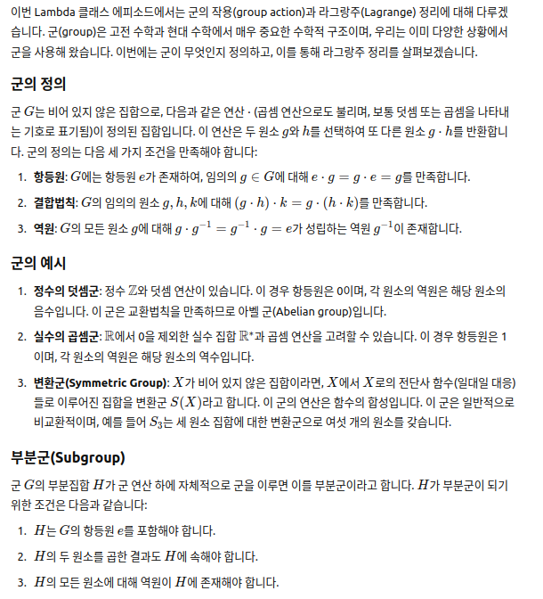
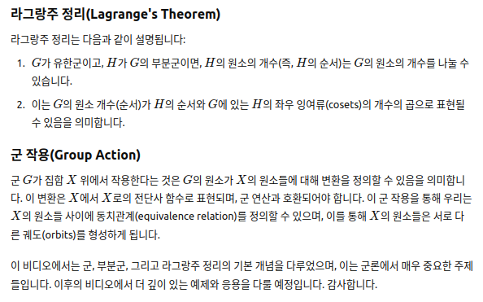

# Groups, actions and the Lagrange Theorem

## 한글:

이번 Lambda 클래스 에피소드에서는 군의 작용(group action)과 라그랑주(Lagrange) 정리에 대해 다루겠습니다. 군(group)은 고전 수학과 현대 수학에서 매우 중요한 수학적 구조이며, 우리는 이미 다양한 상황에서 군을 사용해 왔습니다. 이번에는 군이 무엇인지 정의하고, 이를 통해 라그랑주 정리를 살펴보겠습니다.

### 군의 정의

군 \( G \)는 비어 있지 않은 집합으로, 다음과 같은 연산 \( \cdot \) (곱셈 연산으로도 불리며, 보통 덧셈 또는 곱셈을 나타내는 기호로 표기됨)이 정의된 집합입니다. 이 연산은 두 원소 \( g \)와 \( h \)를 선택하여 또 다른 원소 \( g \cdot h \)를 반환합니다. 군의 정의는 다음 세 가지 조건을 만족해야 합니다:

1. **항등원**: \( G \)에는 항등원 \( e \)가 존재하여, 임의의 \( g \in G \)에 대해 \( e \cdot g = g \cdot e = g \)를 만족합니다.
2. **결합법칙**: \( G \)의 임의의 원소 \( g, h, k \)에 대해 \( (g \cdot h) \cdot k = g \cdot (h \cdot k) \)를 만족합니다.
3. **역원**: \( G \)의 모든 원소 \( g \)에 대해 \( g \cdot g^{-1} = g^{-1} \cdot g = e \)가 성립하는 역원 \( g^{-1} \)이 존재합니다.

### 군의 예시

1. **정수의 덧셈군**: 정수 \( \mathbb{Z} \)와 덧셈 연산이 있습니다. 이 경우 항등원은 0이며, 각 원소의 역원은 해당 원소의 음수입니다. 이 군은 교환법칙을 만족하므로 아벨 군(Abelian group)입니다.

2. **실수의 곱셈군**: \( \mathbb{R} \)에서 0을 제외한 실수 집합 \( \mathbb{R}^\* \)과 곱셈 연산을 고려할 수 있습니다. 이 경우 항등원은 1이며, 각 원소의 역원은 해당 원소의 역수입니다.

3. **변환군(Symmetric Group)**: \( X \)가 비어 있지 않은 집합이라면, \( X \)에서 \( X \)로의 전단사 함수(일대일 대응)들로 이루어진 집합을 변환군 \( S(X) \)라고 합니다. 이 군의 연산은 함수의 합성입니다. 이 군은 일반적으로 비교환적이며, 예를 들어 \( S_3 \)는 세 원소 집합에 대한 변환군으로 여섯 개의 원소를 갖습니다.

### 부분군(Subgroup)

군 \( G \)의 부분집합 \( H \)가 군 연산 하에 자체적으로 군을 이루면 이를 부분군이라고 합니다. \( H \)가 부분군이 되기 위한 조건은 다음과 같습니다:

1. \( H \)는 \( G \)의 항등원 \( e \)를 포함해야 합니다.
2. \( H \)의 두 원소를 곱한 결과도 \( H \)에 속해야 합니다.
3. \( H \)의 모든 원소에 대해 역원이 \( H \)에 존재해야 합니다.

### 라그랑주 정리(Lagrange's Theorem)

라그랑주 정리는 다음과 같이 설명됩니다:

1. \( G \)가 유한군이고, \( H \)가 \( G \)의 부분군이면, \( H \)의 원소의 개수(즉, \( H \)의 순서)는 \( G \)의 원소의 개수를 나눌 수 있습니다.
2. 이는 \( G \)의 원소 개수(순서)가 \( H \)의 순서와 \( G \)에 있는 \( H \)의 좌우 잉여류(cosets)의 개수의 곱으로 표현될 수 있음을 의미합니다.

### 군 작용(Group Action)

군 \( G \)가 집합 \( X \) 위에서 작용한다는 것은 \( G \)의 원소가 \( X \)의 원소들에 대해 변환을 정의할 수 있음을 의미합니다. 이 변환은 \( X \)에서 \( X \)로의 전단사 함수로 표현되며, 군 연산과 호환되어야 합니다. 이 군 작용을 통해 우리는 \( X \)의 원소들 사이에 동치관계(equivalence relation)를 정의할 수 있으며, 이를 통해 \( X \)의 원소들은 서로 다른 궤도(orbits)를 형성하게 됩니다.

이 비디오에서는 군, 부분군, 그리고 라그랑주 정리의 기본 개념을 다루었으며, 이는 군론에서 매우 중요한 주제들입니다. 이후의 비디오에서 더 깊이 있는 예제와 응용을 다룰 예정입니다. 감사합니다.

## ChatGPT 스크린샷

## 영문:

Maddox in Lambda class in this episode we're going to discuss groups actions
and the linear Grange theorem okay so groups are a very very important
mathematical structure In classical and modern mathematics
and uh they appear everywhere and we have been using groups without naming
them for quite a bit now uh actually groups are used to describe
very ordinary situations and also very sophisticated ones okay so let's start
with the definition of what a group is and this is
one of the most useful mathematical entities that you can come across across
so let G be a non empty
set um such that it is equipped
with and operation
fight it takes two elements of G and returns
another element of G usually Phi of G and
H we're gonna use polish notation and this is going to be
G star H this is going to be The annotation
that we're going to use describe the image but if I applied to G
and H such that
okay the first thing uh we're going to require uh there exists
and element e belonging to G such that
e against
H equals h
star e and this is H for every H in G
second of all uh five is associative
that means that whenever you need to um
make this operation this equals G Star h a okay
and for every four
Each G in G there exists
uh G tilde such that G Star G tilde
equals g tilde Stars G and this is e
okay uh this element e this distinguished Element e is called the neutral
element four five
e is the neutral element for Phi this is called the group operation
Phi and the group operation has a neutral element called e
it's uh sometimes it's also called the identity for the group operation
then uh Phi is associative we can associate that means that we can use
parenthesis however we like and finally this G tilde
accounts for the inverse respect to the group operation G tilde
is the star inverse
of G all right so uh there are many many
examples for this and they are all very well known for us
examples
okay the first example we're going to show is the integers and the sort
operation simply take addition uh we are going to uh
say that G Star this uh Tuple
is the way we we are going to know the groups in this case it's C with addition
okay addition is obviously um associated
okay in this case
the neutral element is zero and uh the inverse for G is actually minus G
okay example one uh we observe
we observe that in this example
uh the group operation
is also commutative
which is not required by the definition okay the definition just requires Phi to
be Associated okay but in this case it is also commutative
observation uh wrote
with a commutative
Phi are called a billion
groups also called commutative groups okay
second example two
right in this case let's take G the real numbers minus zero
plus r minus number zero okay so this is a subset of the real numbers
and the star operation is going to be simply multiplication
standard scholar multiplication now in this case
the neutral element is going to be just the number one so 1 times x equals X for every uh real
number X and the inverse of G
simply going to be uh 1 over G also noted G to the minus 1.
okay so the multiplicative inverse is just the reciprocal object and this can be
taken since every J is non-zero okay
so these are two examples in which uh the group operation is commutative well
it is not the case that every group is commutative sample
three um
um let's get to a more involved example let X be a
non-empty set and let's take s of x
simply the functions from X to x dot r byjections
okay bijections are functions that can be inverted okay so
this is going to be our underlying set for the example bijections
from X to X and now the star operation is going to
be function composition
in case you don't remember um if a if f and g are
two rejections or two functions in general uh the composition
of f and g applied to an X is defined to
be f apply to the image through G of x
okay and now the underlying set
with the composition of functions yields a non-commutative proof that is a
non-abelian group okay composition
this turns out to be
a non for me to do
let's show with an example that this is the case but you know uh in this case
the um neutral element is simply the identity
this is the function identity X
is the function that simply takes an element of X and leads it
right over there identity
function so composition of function is now
commutative and here the neutral element is simply the
identity function Let's uh make an example of this example so
example three B
three B so to fix ideas
let X be the set one two and three
so s of x just consists of the bijections from X
to X
okay maybe we can list uh which are the elements of s of x
first of all the identity element is the function that takes
one to one two two and three to the number three so this table
portrays the identity element okay it's a correspondence between
elements of x and elements of X maybe you can think of
it as a reordering of one to three okay so what else well we have another
table maybe the function that sends one to the number two
and then 2 to the number one and then three to
the number three this is another element of s of X since this is cyber ejection
now this function takes exactly instead of one two three to the set to
the set one two three simply a of reordering
Let's uh go and find another one maybe uh the element H will take one two
three two number two and three to number one this is it another one
uh of the elements of the S of x and maybe there's another one right
maybe we can find more in this case
it's not that complicated um maybe the one that says one goes to two
and then two goes to three and then three goes to two two one I'm sorry
let's call it k and uh let's go and draw another one
or closer to the end one goes to three then 2 goes to 1 and 3 goes to 2.
let's call this one L and let's go for the last one
Okay so what else will have the ones that fix
three we have uh the when the ones that fix number two right
right so this is m then we need uh
so we have two that fix number three two that fix number two and the one we need the ones
that fixed number one okay so um one goes to one
uh two goes to three and three goes to two
and this is it s of X is the set of functions
this six functions s of X consists of the identity f
h k l l and m
so we say that s of X has exactly
six elements this is a finite
group because it has a finite number of elements
so we will show now that this is a non-community group using composition
let's show with an example
then s of x composition is not commutative
let's take for example the last two let's take l and m
see if this works
now
okay so let's try to compute the um composition of l m
first of all let's try to figure out what L composed with m is
right so in order to see what function is we
need to learn what it does to each and every element of X so what does
L compose for them do to number one well first of all m
takes number one and then spits out number one
and now L takes number one and spits out number number three so go we have that
one goes to three now let's see what it does to you number
two so M takes number two produces number three then L takes number three
and gives back number two okay so finally M takes number three
spits out number two L takes two and spits out one
so this is the effect of actually composing L with m in this order
take a look I'll compose with M ends up being uh
uh ends up being h observe
that L composed with M gives h another element of the group
yet what happens when we do it in the opposite way
now we take number one give it a two L then L spits out number three and n takes
three and spits out two then uh number two give it two to l l
spits out one M takes one and spits out well
finally we take three we give it to l l hands out number two and M hands out
number three so in this case uh M composed with L and
sub giving simply f
M composed without gives f in any case
since
these tables are different
we conclude that M composed with L is different from L composed with m
that means that s of X with composition
is not a commutative
it's not a community group okay so this is a finite Group which is now
commutative before we've seen our infinite groups and this is an infinite set and this
also is an infinite set so if groups can be find it infinite commutative or non-commutative there are
many flavors of groups okay so this set is called the set of
transformations of x observation
observation this is very important um if x is a non
empty set s of x
is called the um set of transformations
of x and or also
the set of symmetries
of x okay we're going to use this many many
many times okay so it's a very important example some observations for groups
first of all the identity element
is unique there's only one element that can act as
an identity suppose
e and uh e uh Prime our identities
in a group G
then they're the same and the previous very very simple
um proof so if e is
the identity then uh
e times the tilde e Prime has to be e Prime
right but
if e Prime is the identity
then e times e Prime has to be e
so this leads to e Prime equal to E
which is kind of obvious right second of all
secondly uh for G in G
um there's a unique
inverse detailed it that is if two elements act as the
inverse of G then um
they're the same
that is if you tilde and G tilde tilde or
both inverses for G then you take one side
and the proof is also kind of similar proof
is similar right because we need to show that these
two elements are the same so what we can do is we can express
as G times
the identity and now we can express
the identity as I've written times but you know we can
read it as a star and we can express this as G Star the uh
inverse g t Delta tilde and now since the operation is associated
you can associate this like this and now we're going to use that g tilde
is a inverse so this gives e star G till the tilde
and since e is the identity we derived that g tilde has to coincide
with GT little so they're the same inversers and neutral elements are
unique in a group okay and this comes from the
possibility of having an associative operation like Star okay
observation um
there are mainly
uh two uh notations
uh we use Plus for commutative groups
and we use Dot for uh
not necessarily commutative
so it's way easier for us to use the dot notation
the star symbol is kind of complicated sometimes so from now on we're going to
stick to the multiplicative notation and that does not mean that we
are talking about Community groups multiplication will cease to be commutative unless
specifically said okay so there are plenty of examples of
groups we just talked about transformation groups and we have talked about the integers
with addition and non-zero real numbers with multiplication
okay but there are many many others right uh let's talk about subgroups
so
ASAP group what is a subgroup okay the subgroup uh is a group within a group
okay let's and G
be a group
okay uh we say
that a subset h is a subgroup
of G and we
note it h
less than G if h
with the dot is itself a group
this is a non-trivial observation
the observation here is that this operation the start
is defined as
a function that takes two elements of G and produces an element of G
so this as a function has domain G times G
if you think of the domain of the DOT it is simply G times G
this is the domain of the dot the original dot that was designed for G
so what does it mean that uh age and Dot is itself a group
this means that since H is a subset
of G
this is H and this is H then not restricts
to H times G
nicely this means that dot will take two
elements of H and produce an element of H not only an element of G
it would produce an element of H okay so we're going to State this in a
concise way giving a more
common definition and we will see one of the
consequences of the definition and we're going to place some examples of H and then we're going to note
something that's very important for us okay we're going to talk about group actions once we
Define subgroups and group morphisms so
H is a subset of G is a subgroup
if well first of all the identity element of G needs to
belong to H so this also means that H is an empty set
two whenever uh H1
and H2 belong to H then their product
also belongs to H three each time H belongs to H then it's
inverse also belongs to H this three conditions
are the usual definition of a subgroup of RG
okay it needs to contain the identity element of G
which means that whenever we want to think of the identity of H is simply the identity of G
okay each time we take two elements of H and
multiply them together we also get an element of H that means that dot restricts nicely to H
class h and the inverses also okay
um since h is an h and also an element of G
then the inverse of H lies in G but also
with h so taking a look at the inverse of H in the smaller group is actually the
same as looking at it in the bigger group okay
being a subgroup is being a substructure okay so everything we say for groups
holds for subgroups there's no problem there okay let's take a look at some
examples examples of subgroups
examples well if we go along the same lines that
we went before let's take the ambient group of being Z and let's take H to V
even numbers
this case um we will describe H as things of the form
to [Music] times L for
um l in Z okay
and here the operation is obviously plus
so why is it that H is a um
Y is H a subgroup
oh this is fairly trivial let's prove that the identity element for G that was
0 belongs to H that's obvious since 0 is
actually two times zero okay that's easy
let's see if H1 and H2 belong to H we need to show that uh
uh there are some here we're using additive notation remember that
that there are some also belongs to each and that's obvious
because the sum of two even numbers is also even so each one is of the form two times L1
for certain a one and said
H2 times L2 or certain L2 instead
and so the sum two times so one plus two times O2
and this is 2 times a one plus or two and since this
is an integer because the sum of two integers instant integer it says that
the sum belongs to H so H is closed under addition
and lastly
if H belongs to H then it's inverse
minus H also belongs to H okay and this is easy
it's minus h minus 2 times L for certain L and this is 2 times
minus l and since this belongs to set
this belongs to H okay so actually H is a subgroup of the
integers so we have shown that this is is a
subgroup of a commutative group infinite community group okay
so basically we have three things to check let's make a more involved example
sample two example two let's fix X
as I said one two three and four okay
and in this case we have the group of translations for X
that is the bijections from X to X the operation is going to be
function composition right and let's take a look at the
functions from X to X such that F of 1 gives one and F of 3
gives three okay we need to show that this is actually a subgroup object
will show that um
H is a subgroup
for uh J all right
so why how come well first of all the identity element in J simply the
identity and the identity of x
's every element of X in particular
the identity applied to one returns one and the identity applied to three
returns three so that means the identity is an element of H
so the neutral element for G also belongs to H that's easy
now let's take f and g down into h
will need to show that the composition also belongs to H and that's easy right
because all we need to do is we need to see what this composition does to number one and what this composition does
number three by definition this is f applied to G of
one and since G belongs to H
G of 1 needs to be one
and since F belongs to h f of 1 needs to be one
so the composition fixes one so it's one to number one
by the same token composition
also fixes three so the composition fixes one and three then composition
belongs to H finally
if s belongs to H then we need to see if
it's inverse belongs to H as well
okay so why we need to check
we need to see
what does the inverse do to number one and number three easy
since F of one this one applying the inverse
to both sides
and now using the definition of the inverse
right this is simply f composed death at one
and this function is actually the identity like the one and the identity applied to
one simply one so what we have shown is that the
inverse of f applied to one gives simply one we have shown that the identity
of the inverse of f also fixes one and by the same token we can show that the
inverse of f also fixes three and that means that the inverse of f belongs to H
as well since the element F in anxious
generic then H ends up being a subgroup of a non-commutative group G
all right that's awesome Okay so
we have one more example of a subgroup which is an important example
important
sample
okay how do you define groups and subgroups we're gonna take a look at uh
what sort of functions are going to allow are we going to allow between groups
and that requires that we talk about group morphisms
so a group morphism is a function between groups that is compatible with
the group operations so let
D1 with star one operation and G2 and star
2 operation in two groups
a uh group morphism
f is a function
it's a function F that goes from G1
to G2 is simply a function such that
whenever we apply f to G1
star one let's change the notation G star one
h this is equal to F of G star 2 F of H
okay this is what a group morphism from G1 to G2 is
first observation is this operation is performed in G1
in G1 we take two elements of G1 okay and start them together with the
operation native in G1 when we push that to the right
we had two elements of G2 that get operated in G2 so this
operation
takes place in G2 so f is compatible with the group
operation F transforms operations in G1
two operations in G2 right that that's what a group morphism is
um usually observation
if context is understood
we will under we will always have in mind that these operations are different
and we may use the same symbol for them always taking care and keep in mind that
these are different operations performed in different environment sets
so we say that F applied to G times H is
actually F or G times F of H
this dot here is different from this data here they're different
okay so this will uh alleviate the notational
burden sometimes but it's a fairly easy to to work with
amorphisms once we understand that difference now keeping the notation
simple is key for us okay some observations and things that we can
deduce from the very dividend from the very definition
from the definitions
okay also we'll use e for both inverses
okay for both uh neutral elements for G1 and G2 okay the first uh first of all
we are going to show that if f
is a group morphism
then F of uh the neutral element of G1
has to be the neutral element of G2 okay
but this is something we need to show all right and how do we do that
neutral element goes to neutral Island how come
[Music] well the neutral element
when you um acted on itself it gives itself the neutral element
okay this is this identity is Trivial since E1
is the neutral
element of G1 so when you apply f
the sides and you use that this is actually a
group morphism what you get here is that
F of P1
applied to F of B1 has to be F of E1
so since F of E1 is an element of the group G2
it has an inverse
let's call it I don't know maybe let's call it k
so if we act k
both sides and we associate
now K times 1
acting on fov1
since K is the inverse this is actually E2
and this is actually E2
and since E2 is the
identity or neutral element of G2
this is actually F of one so we landed where we wanted to land F
takes the uh neutral element of G1 and Maps it to the
neutral element of G2 all right so for a function in order to
be a group morphism it needs to take neutral element to a neutral element
all right second well it also behaves well under
inverses right um
F of the inverse of an element H needs to be the inverse
of f of H okay this is also
um easy to show right since
the inverse of H times h
this is the neutral element of G1 applying f both sides gives F of one
we have shown that this guy over here needs to be the neutral element of J2
and since f is amorphism F applied to the inverse of H
by 2. F of H gives this
but then since inverses are unique
since inverses are unique
we know that this guy shows a place a
role
of the inverse of FH
then it is the inverse of the fudge the inverse of f of H has to be F of the
inverse of H so group morphisms are compatible with the group operations
okay they are compatible with the group operation
and that means that they need to take the identity to the identity and they inverse it to the inverse okay not only
to the operation itself but it respects uh neutral elements and
inverses so group morphisms are a very nice thing
to work with and there are many many theorems about group morphisms okay but
we're going to um talk about something specific that we have
maybe we can have examples before but let's
go deeper now let's talk about group actions
Let's Get Serious
let X be a non-empty set
and let G
be a group that's h mean
[Music]
we'll say that H Acts
on x if there is
a group more efficient
PSI that takes elements of H to
elements of the transformation group of x
that is to each element of H what we have is
a bijection [Music] from X to X
so we need we have a form a way of identifying elements of H with
bijections of x and that is what we call a group
morphism a a group action notation
when PSI is understood
or implied we simply uh
write the page acts on x using PSI
okay this letter is usually omitted and we just keep
this notation for H acting on x
okay so there are many things to say about
actions we're going to go deeper in a different video but um
we need to say one thing whenever we have an action we're going to have
equivalence relation
observation slash theorem
if a group H acts on x then
we have an equivalence
relation
on x X will be H related to y
if and only if
there exists small age such that
Phi H takes X to y
okay so this is the definition
of an equivalence relation and we're going to show that this is an equivalence relation
okay some notation
the image through 5 of H is actually
um 5 h
s yeah I have H this is a rejection
is a by objection
from X to X so this is a function
is an element of G element of H
and the image is actually a function
and in addition that we're going to use
this function applied to X
X is an element of the X this will be noted H acting
on x X and this will sometimes have the Phi
some texts that Phi is omitted because it is understood that
this is an element of a group and this this cake there are not two elements of
a group okay so once we have cleared in our heads that there's a difference between
those two dots we can go along and play the game but if we're not used to it we need to
use the sub sign over there right
so let's show that we have an equivalence relation and we're going to show that for a
certain action that equivalence relation yields what we call the lag range theorem Okay so
let's show
let's show that
this is an equivalence relation
so to show that this is an equivalence relation we need to show three things okay
first of all we need to show that this is reflexive
well and that's easy because uh the identity
acting on x is simply Phi of the identity applied to
X okay but we have said that that
PSI is a group morphism
so this function needs to be the identity
needs to be the identity of x
so this is the identity of X applied to the element X and the identity
Vex yields X so what have we seen we have seen that
the neutral element of H acts fixing X
so this means that X is related to itself
okay and we have seen this because a group morphism sense the identity
of H to the identity of the transformation group Sox
that's the first part now let's show that this is symmetric
so I wanted to show that this relation is symmetric
okay so let's suppose
that X is related to y
that is [Music] um there is an H in the group such that
H X on x and yields y
all right so we need to show that there's another element
okay there's another element of H that takes y to X
and since these are two elements
x what we can do is we can apply this insert the same element we can apply
a different function so let's
use H to the minus one to act
on this element so what are we going to do we're gonna
make H to the minus one act on this element
so that is H to the minus 1 is acting on y okay so if you take a look at this what
does this mean this is [Music] um
five sub h to the minus one
applied to the element h acting on x
okay but what is this this in turn is actually Phi
corresponding to H to the minus one applied to Phi corresponding to H
apply to X
and this is actually composition of functions this is this function composed with this
function applied to X
but PSI is a group morphism
so this ends up being what this ends of beam
uh PSI
of H to the minus 1 times h
acting onyx
all right we can show up mcmurugan and this is not
the right notation this is simply let's is it like this
this is PSI
at H uh to the minus one composed with PSI composed
with h and now we use that PSI is a group morphism
and this is simply so I applied to H to the minus one
times h
so this is almost here now because since these two guys are inverse to each other
this is PSI applied to the identity element
and this has to be the identity element of the transformation group so this is
the identity of x
latinox
and the identity of X acting and X is actually uh do we need to say now here it's
I'm missing this parenthesis over here
and this is simply X so we have shown that if
H takes X to y then H to the minus 1 takes y to X that
means that Y is H related to X so this means that this relation is
actually symmetric whenever we have we have X related to Y
we also have y related to X all right and lastly
three this relation is transited
suppose that X is related to y
and Y is related to uh C
then we need to show that X is related to C
and this is simple
this is simple what does this mean well this means that
um there exists
H1 such that H1 Acts on X and returns y
and what this this mean now this mean that there
exists H2 such that H2 acting on y gives
Z and this is easy now because
H2 acting on y returns Z and now we can write H2 acting on H1
acting in x and this is simply H2
times H1 acting on X and this is C
Okay so here we have it X is related to Z
o h so
what we have now is uh an equivalence relation
is an equivalence
religion and this means that
uh we have orbits
the equivalence
class under this relation
for an X belonging to X is called the orbit
orbit of x
the equivalence class is called the orbit of X and it consists of all the
elements of X such that uh h
acting on X returns y all the things that can be reached
moving X using elements of H all right
so that's that's very important for us this is the definition of the orbit of x
right and to conclude this video we're going to talk about something
important that's the LaGrange
action so let's
G be a group we have find it
and let h be a subgroup
doesn't really matter if G is commutative or not what's important for us is that g is a finite group and that
age is subtle so let's define let's take a look
at the following action
the action is going to take an element of H and it's
um I'm going to do the following okay
we're gonna take a look at the bijections of G okay by Junction sub G and that are
defined this way so if you take an H you're going to take a look at this by
attraction the by ejection corresponding to H
takes a g and it multiplies G to uh
the left by h so it can be checked that this PSI
is an action this is H is acting on its
on its ambient group sometimes they say by translation on the
left you multiply it using the small age to the left of G
these are by ejections the service claim that is very simple to find to prove
first of all Phi sub H is a bijection
for every H and H that's an easy claim for you to prove
and it's easy to show that PSI is
is a group morphism
and that's easy since um
PSI of H1 times H2
is a function that takes times of G to elements of G
and we're going to apply to uh
G and what it does is multiplies
G using this element okay so now what we have here is that
um this multiplication
is simply taking by the definition
of PSI this is taking the element H1 times H2 and use it to multiply G to the
left these are all multiplications in G
these dots are all multiplications in G right and now we use that multiplication is
associated right so this is H1 multiplying
these two lines together right
and this is simply PSI
of H1 applied to psi of H2
applied to G and this is simply
this function composed with this function applied to G
so what we have shown is that this is essentially
this composition
so PSI is in effect
a group action
see this is called the LaGrange action
of H on G okay and this action will Define
a partition this action
finds a partition of G
into uh disjoint equivalence classes
strong orbits that means that g can be thought of
as the Union of finitely many classes
not since G is find it
each already find it h of X is find it
and also there are finally many classes
so this means that if we think of G
like this then we have finally many classes
class corresponding to uh G1 G2
G3 G4 the class of G5 the class of G6
Etc but with one uh a very interesting observation
in general
orbits for a general action for a generic
action they're different
if and specifically they have different
sizes but for the branch action if you take a look at it
the orbit of of G is actually all the elements uh K
belonging to the group G such that uh
uh there exists an H NH that act acting
on G give k but this action is actually group
multiplication for the LaGrange
action this is simply
the group operation so the class of G is actually the set
h G
and we are meaning all the things of the form H times G for H and H
so this means that whenever we take an element of G and take a look at its orbit the orbit of G
it's always of this form the orbit of G is H times G
so this means that the amount of elements in a orbit
of G is actually the number of elements in here and this is actually the number elements
of H and this is crucial
insurbate has number of elements of age elements
so going back
to the partition of G
G can be thought as a
finite number of uh orbits
and since uh Union this Union is the joint the number of elements of G is
actually the sum of the number of elements in each orbit
and all these guys are the same they all have the same number of elements so this
is simply and times the number of elements of H
this natural number n is called the uh the number of orbits
it's called the index of H index of H
in G ins the number of orbits that appear when we take a look at the
LaGrange action Okay so this is written like this the order of G
is the index of H in G times the order of
H and this is what we call the LaGrange theorem
okay this is what we call the LaGrange theorem it simply States
following if G is a finite
group and H is a subgroup
then the order of H divides the order of G
the order of H divides
the order of G
so subgroups are very special objects okay
since they need to be closed under uh uh the group operation they need to be
closed undertaking inverses and they need to contain the identity element
they cannot have any shape without structure
all those constraints make subgroups very special subsets they
need to contain a number of elements that necessarily divide the number of
elements of the ambient group okay so this is a very powerful theorem and
since there are many things that qualify as finite groups this theorem takes
different forms okay and will give us lots of information in very different
contexts and we're going to use that soon in order to talk about field
extensions we're taking this detour maybe long overdue on detour into group
Theory because when we went to play with Starks and we need to choose a domain size
to perform some proof checking we need to do that in a very um
smart way because we have described how the start protocol works
but that's um a good theory how do we Implement that how do we tell
if we can find a polynomial that actually does what it promises does
well the number of elements in in a domain has something to do with it because when
the number of elements in a domain is a power or two then we can have a good and
fast strategy to solve the problem okay so we're going soon to be joining this
idea of playing with groups with the idea of extending a field with the idea
of solving the Stark's problem in Practical terms in a fast and efficient
way we will need elements of Fourier transform and we will need more elements
to this but the choice of the domain size to perform starts is not a something
easy we need to choose a domain size that will enable us to perform that
calculation and that verification quickly in order to do that we need to learn
some things about group extensions and field extensions as well so this is it for now
let this sync we're gonna go through a bunch of examples in the following videos and we're going to take this long
turn it's a long curve and we'll rejoin Starks in a couple of videos time okay
thank you for watching and feel free to watch again as many times as you want okay goodbye

## 원본링크: https://www.youtube.com/watch?v=BtRIDyue0fA&list=PLFX2cij7c2PynTNWDBzmzaD6ij170ILbQ&index=5
