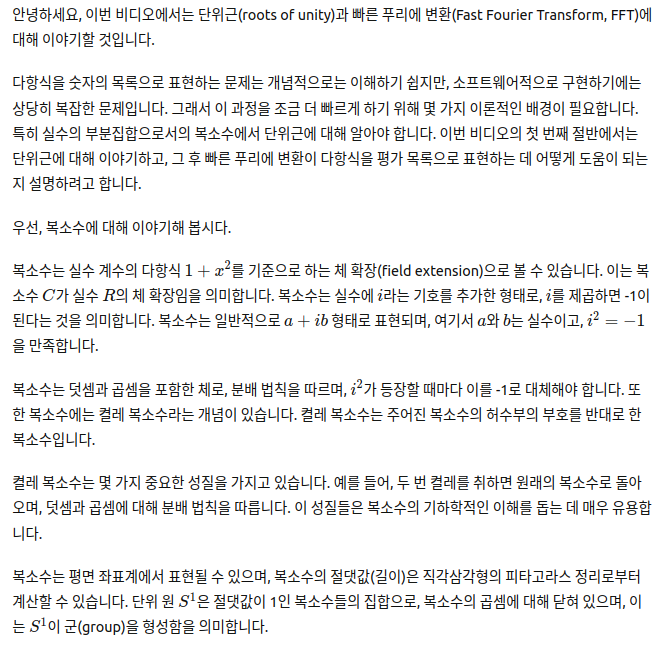
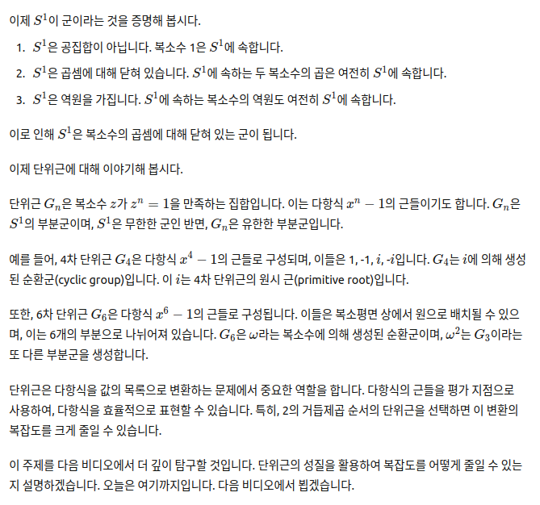

## Roots of unity and the FFT: Back to the representation of polynomials

## 한글:

안녕하세요, 이번 비디오에서는 단위근(roots of unity)과 빠른 푸리에 변환(Fast Fourier Transform, FFT)에 대해 이야기할 것입니다.

다항식을 숫자의 목록으로 표현하는 문제는 개념적으로는 이해하기 쉽지만, 소프트웨어적으로 구현하기에는 상당히 복잡한 문제입니다. 그래서 이 과정을 조금 더 빠르게 하기 위해 몇 가지 이론적인 배경이 필요합니다. 특히 실수의 부분집합으로서의 복소수에서 단위근에 대해 알아야 합니다. 이번 비디오의 첫 번째 절반에서는 단위근에 대해 이야기하고, 그 후 빠른 푸리에 변환이 다항식을 평가 목록으로 표현하는 데 어떻게 도움이 되는지 설명하려고 합니다.

우선, 복소수에 대해 이야기해 봅시다.

복소수는 실수 계수의 다항식 \(1 + x^2\)를 기준으로 하는 체 확장(field extension)으로 볼 수 있습니다. 이는 복소수 \( C \)가 실수 \( R \)의 체 확장임을 의미합니다. 복소수는 실수에 \( i \)라는 기호를 추가한 형태로, \( i \)를 제곱하면 -1이 된다는 것을 의미합니다. 복소수는 일반적으로 \( a + ib \) 형태로 표현되며, 여기서 \( a \)와 \( b \)는 실수이고, \( i^2 = -1 \)을 만족합니다.

복소수는 덧셈과 곱셈을 포함한 체로, 분배 법칙을 따르며, \( i^2 \)가 등장할 때마다 이를 -1로 대체해야 합니다. 또한 복소수에는 켤레 복소수라는 개념이 있습니다. 켤레 복소수는 주어진 복소수의 허수부의 부호를 반대로 한 복소수입니다.

켤레 복소수는 몇 가지 중요한 성질을 가지고 있습니다. 예를 들어, 두 번 켤레를 취하면 원래의 복소수로 돌아오며, 덧셈과 곱셈에 대해 분배 법칙을 따릅니다. 이 성질들은 복소수의 기하학적인 이해를 돕는 데 매우 유용합니다.

복소수는 평면 좌표계에서 표현될 수 있으며, 복소수의 절댓값(길이)은 직각삼각형의 피타고라스 정리로부터 계산할 수 있습니다. 단위 원 \( S^1 \)은 절댓값이 1인 복소수들의 집합으로, 복소수의 곱셈에 대해 닫혀 있으며, 이는 \( S^1 \)이 군(group)을 형성함을 의미합니다.

이제 \( S^1 \)이 군이라는 것을 증명해 봅시다.

1. \( S^1 \)은 공집합이 아닙니다. 복소수 1은 \( S^1 \)에 속합니다.
2. \( S^1 \)은 곱셈에 대해 닫혀 있습니다. \( S^1 \)에 속하는 두 복소수의 곱은 여전히 \( S^1 \)에 속합니다.
3. \( S^1 \)은 역원을 가집니다. \( S^1 \)에 속하는 복소수의 역원도 여전히 \( S^1 \)에 속합니다.

이로 인해 \( S^1 \)은 복소수의 곱셈에 대해 닫혀 있는 군이 됩니다.

이제 단위근에 대해 이야기해 봅시다.

단위근 \( G_n \)은 복소수 \( z \)가 \( z^n = 1 \)을 만족하는 집합입니다. 이는 다항식 \( x^n - 1 \)의 근들이기도 합니다. \( G_n \)은 \( S^1 \)의 부분군이며, \( S^1 \)은 무한한 군인 반면, \( G_n \)은 유한한 부분군입니다.

예를 들어, 4차 단위근 \( G_4 \)은 다항식 \( x^4 - 1 \)의 근들로 구성되며, 이들은 1, -1, \( i \), -\( i \)입니다. \( G_4 \)는 \( i \)에 의해 생성된 순환군(cyclic group)입니다. 이 \( i \)는 4차 단위근의 원시 근(primitive root)입니다.

또한, 6차 단위근 \( G_6 \)은 다항식 \( x^6 - 1 \)의 근들로 구성됩니다. 이들은 복소평면 상에서 원으로 배치될 수 있으며, 이는 6개의 부분으로 나뉘어져 있습니다. \( G_6 \)은 \( \omega \)라는 복소수에 의해 생성된 순환군이며, \( \omega^2 \)는 \( G_3 \)이라는 또 다른 부분군을 생성합니다.

단위근은 다항식을 값의 목록으로 변환하는 문제에서 중요한 역할을 합니다. 다항식의 근들을 평가 지점으로 사용하여, 다항식을 효율적으로 표현할 수 있습니다. 특히, 2의 거듭제곱 순서의 단위근을 선택하면 이 변환의 복잡도를 크게 줄일 수 있습니다.

이 주제를 다음 비디오에서 더 깊이 탐구할 것입니다. 단위근의 성질을 활용하여 복잡도를 어떻게 줄일 수 있는지 설명하겠습니다. 오늘은 여기까지입니다. 다음 비디오에서 뵙겠습니다.

## ChatGPT 스크린샷

## 영문:

another video for Lambda class in this video we're going to talk about roots of
unity and the fast Fourier transform um
well the way of um dealing with the problem of representing a polynomial as
a list of numbers um
it's very complicated one in the sense that it's conceptually simple to understand
but it's difficult to implement in terms of a software implementation
this is a reason why we need some Theory to speed up that process a little bit
this is going to require that we know some things about roots of unity
especially over the real numbers as a subset of the complex numbers so
we're going to be talking maybe the first half of the video about roots of unity and then we're going to try to
explain how the fast Fourier transform um comes in to help us in this problem
of representing a polynomial as an evaluation list okay so uh first of all let's talk about
that's about the complex numbers
okay we uh from what we have seen before the complex numbers is simply uh the the
Ring of polynomials or uh the real numbers over the polynomial one plus x squared
this is a way of looking at the complex numbers in terms of field extensions
this means that means uh
that c is a field
extension of r
we can see this as
adding a symbol called I to the real numbers in
this sense usually what's uh said is that the
symbol I when you square it you get -1 which is precisely what happens when you
uh take a look at C in terms of rings of polynomials okay in
this version uh we know that the polynomial 1 plus x squared equals zero
so this means that x squared is minus one
this um later representation in terms of an
imaginary unit is simply a renaming of the
letter X okay so back in business
complex numbers are simply expressions of the form a plus
IV where A and B are real numbers
such that I squared equals minus one
okay so this is usual set of complex
of course um C is a field okay we can add
C is a field complex numbers
may be added and multiply it together
with the usual uh distributive laws taking in account that
every time that you see I squared you must replace that with -1
but there's also a um a new operation in C which is a
conjugation see this equipped
with a conjugation
that means that if we have a complex number
we may build a new one out of the L1 just by reversing the sign of its
imaginary part it is said that uh this guy right here is the conjugate of this guy right here
conjugation
has uh some nice properties
okay one of the properties of conjugation is that it's an evolution
uh when we conjugate two times we fall back into the original complex
and uh well conjugation is uh distributed respective
addition and also conjugation distributes over products
all right so these are very very nice properties and
as we will short see conjugation uh leads the way to
understanding some geometry of the complex numbers Okay so
uh we may
we present complex numbers
in a Cartesian conversation
plane this is we may have a representation of the complex numbers
where um it's complex number A plus a b
this is a and this is IB
okay so this point in the plane is actually represented
by the pair r a comma B so in this sense C can be understood as
the real plane okay you may think of this complex as an
arrow from the origin all right and uh it turns out
that when you multiply together uh C and Z
conjugate what you get is simply a square plus b squared which coincides
with the length of this Arrow this is what we call the absolute value of said
Square of course uh this result is compatible
with the idea that what we have here is simply a
side a leg of either right triangle
is uh sure is a this measure is B and
this just says Pythagoras okay so there's a relation between
conjugation and measuring complex numbers
all right um since we have
a notion of length
gives a notion of length
for complex numbers we may start
to think of certain subsets
and the most important one is actually the unit circle S1 stands
for the uh unit Circle
and it consists of all the complex numbers
that have measure one all right all the complex numbers that have
measure one if you want to take a look at it it's simply a circle
of length of radius one so and place this
just right here
and there you have it if you bear with me with the uh
Precision or imposition this is simply S1 all the complex numbers that live right
there are simply S1 and uh it turns out
that S1 has very nice properties when we uh equip S1 with the product of complex
numbers it's one together with complex multiplication
gives a group
okay
we will now show that S1 has some very nice properties when we equip it with
the multiplication of complex numbers okay so we will prove
that S1 is a group
when equipped with a complex
multiplication okay so to prove that something is a group
okay first of all
we need to show that S1 is non-empty okay one is simply
this complex number uh belongs to S1 since
its measured
is simply one okay so S1 is a non-empty
set so we may start working on this
okay then we need to show that we need to
show now
that S1 is closed
under multiplication
okay so we need to show that whenever we take two elements of the unit circle and
when you multiply them together what we'll get is another element of the unit circle
so let's try this uh let's pick
Omega 1 and Omega 2. both elements of the earth Circle
so we know that these guys have measure one we need to show
that Omega 1 times Omega 2 also belong to as one that's what we need to show
and for this we are going to need certain property of the complex numbers
so let's do this let's try to measure
their product and to make things easier for us let's try to measure and square its length
so by definition this is simply it's two guys together
multiplied then we take the conjugate and then we multiply
with Omega 1 times Omega 2. this is simply the definition
of square of the absolute value simply the definition
and now we may use that multiplication in C
is associative and commutative since C is a field
so this means that we can rearrange this expression
however we like and this means that we can first of all use properties of
conjugation here foreign
make
these two uh complex numbers commute so
we end up getting the conjugate of Omega 1 times Omega 1
associate these two guys and then multiply by omega-3 conjugate times Omega 2. and
this is simply the definition of the length squared of Omega 1 times the
length of Omega 2 also squared and now
what we get is that since Omega 1 belongs to S1
this is one and since Omega 2 belongs to S1
this also is one so this product equals one
but we have just shown is that square of the length of the
multiplication of Omega 1 and Omega 2 is 1. this says
by taking square roots that this product has length one and this means that this
product belongs to as one okay so the unit
circle is closed under multiplication
okay it's closed under multiplication now we need to show something else so
not only it's close under multiplications but also we need to show now
to show that S1 is closed
undertaking inverses
this is if we have a complex number
Omega belonging to the unit circle then it's multiplicative inverse also belongs
to us one so that's what we need to show okay so
um let's pick an element of the unit circle
okay let's say we can do it graphically
um okay so we have
uh this pair of axis let's
draw a little circle try to see how this works
so we have this guy Omega here
whatever you like
and we need to show that it's inverse this is what we need to show
so let's take oh my God uh since
Omega is not the zero complex number
then Omega has an inverse
in C this means this is because
C is a field okay so there's an inverse for Omega
we multiply these two guys together we end up having one but then again
taking absolute value
then we have this
and for what I have seen before this is simply the product of the
absolute values and now since Omega belongs to us one
since Omega belongs to S1 then this is actually equal to one
and that observation yields that the measure of the inverse is also one
this means that the inverse of Omega also belongs to S1
so what we have shown is that S1 is an empty subset of the complex numbers
which is closed under multiplication and closed under taken inverses all this
means that well since complex multiplication is associated
because multiplication in the complex numbers is then this means that S1
is a group uh
when the group operation
is simply the multiplication of complex numbers okay so S1 when multiplication we
usually denote this but despair okay
unit circle
and this is a scanner
complex multiplication
all right so um there's
something that's it's really interesting for us that uh observation
when we take a point which is honest one then
um
first of all this is valid for for all uh let's write it like this
for every Omega and C this is valid especially
when we consider omegas that belong to the unit circle
we get that the conjugate also belongs to the unit circle and not only that
also when we multiply these two guys together what we get is one
since this is nothing else than the length of Omega squared
this means that the inverse of Omega is simply the conjugate of Omega
and this is a very important thing that we're going to use later on
Okay so if we have an Omega right here it's
inverse is nothing else than its conjugate
this is Omega conjugate and at the same time the inverse of Omega
so taking inverses can be seen as a geometric operation on the points of the
unit circle all right uh it turns out that this set is very
important and um we can right now we can right now see that this
points on the unit circle Define triangles and if they Define triangles with uh the
axis then we can Define angles turns out that there's a theorem
that's called the demo of theorem that will relate the process of multiplication and exponentiation
of elements of the unit circle with the representation of triangles
first of all let's go through some notation
for Omega being a real number
we will note e to the I um
Theta as the complex number
cosine of theta plus I sine of theta this is valid for all real theater okay
this is the uh exponential
notation and from what we have seen before and
from Pythagoras
the length of this complex number is simply
square of the cosine Plus the square of the sine and this is
simply 1 by Pythagoras
it turns out that there's a representation of the
unit circle as the complex numbers of this form
so the unit circle is parametrized by
this expression okay and uh this is
um three ubiques because this notation of using the exponential or the complex
exponential uh will lead to a very important theorem okay
theorem the mod
uh when you take the nth power or the case power
of elements of the unit circle
not only you get also an element of the inner circle like the group property
but you get this one
and this is uh a very important thing for us
the relation between how we parameterize the unit circle the role of the powers
all bind together by this theorem theorem of the month
this will help us in our study of subsets and subgroups of S1
this theorem will come handy
when starting subgroups
of S1 okay
we'll see that um in terms of uh
terms of the exponential notation
but this says is simply that whenever you want to raise to the power
of K this complex number what you get is simply
K times the argument right there so in a sense this power
gets into the argument of the exponential and this is crucial for us
okay for k and integer all right
and uh this will give us the key to study some uh subgroups of S1
and this is where the uh roots of Unity come okay coming very handy
so let's start with roots of uh Unity
okay so G sub n is simply the set of complex
numbers such that and you elevate this to the nth power
you get one and roots
of our Unity if uh set is
an element of this group oh set then
said is a root of the polynomial
x to the N minus one so the roots of unity are the roots of a
polynomial okay simply the roots of this polynomial and
over C they're exactly n of them
P has exactly and different
roots in the complex numbers
that's one thing this means that this has exactly n elements
that's the first thing okay
the second thing is G is actually a subgroup of s
G sub n is a subgroup
of S1 and that's fairly simple as well right
the neutral element of S1 obviously
belongs to G sub n since this holds and um
then whenever uh
s and t belong to the roots of unity or their n then
smt to the power of n is simply this using
the commutative and associative properties of multiplication and this is simply one
so it says that s times T also or
also it's a root of unity of the order n and finally its GN is close undertaking
inverses
right because since well if G belongs to GN
then G conjugate also
and you um take the nth power this is simply
G times factors conjugate and then you use
the property of distribution of the conjugacy and this is simply
conjugate of G to the n and this is the conjugative one which is one
so whenever uh you have an element gen its conjugate also belongs to GN
and this is simply
one right so this means that g conjugate is
also the square of G
this means that the inverse belongs to GM
okay so GN is really a subgroup of S1
but the difference that S1
is an infinite group
and GN is a finite subgroup
okay so this S1 acts as an ambient group
an infinite ambient group for GM okay so there are many examples of uh GM
let's try some of them
samples G4 fourth roots of unity
right so um if this belongs to G4 then
Z is a root of P of x
to the fourth minus one and this is not really complicated since
this can be thought as a difference of squares
the root server at this polynomial are simply one and -1
and in the meanwhile we take a look at this and the roots of this polynomials
are I and minus I so these are all the four roots of p in
the complex numbers and when you take a look at it
G4 is actually pretty easy to visualize
circle now
okay so one is over here
minus one is over here then we have I and then we have minus I
so G4 has four elements one I minus 1 and minus 5.
right and let's take a look take this one for example
when you square it you get -1 so you jump to this one
if you Cube it then you get minus I that means that multiplying
one more time against I with this one and when we multiply
one more time so we get I to the fourth power we get simply one
so in essence G4 is as is a cyclic group
generated by I turns out that this element generates the rest of the group
okay whenever in change if we take one then we get a
discrete uh simply the um the trivial element
if we take the powers of minus one then we end up jumping between minus one and
one minus one and one so G4 is what's generated by I
if you take the subgroup generated by -1 you end up having these two guys alone
so this marks a difference between two of the roots this root allows me to recover the whole
uh group whereas this root does not allow me to
recover the whole group it shows here that
several generated by this element of the group is a proper
subgroup of G4 so we have a name for this we will say
that I is a primitive
root of unity of order 4. is it the only one no it's not the only one
minus I is also a primitive root of unity of order four
okay so that's what we have there's also more
that's take another example
example let's talk about G6 this is the set of complex numbers such
that uh when you take the sixth power you get one
so elements of G6 are roots
P of x equals x to the sixth power minus
one okay so there are a number of ways of uh
taking a look at this and maybe we can Reason by similarity
here we uh needed
G4 and we ended up slicing the unit circle in um
four places like we have four slices of this pizza
46 we have kind of the same feel to it
Let's uh choose
this one right here so a circle
okay and now what we have is that um one on minus one are obviously roots
of the unity so we have this one and this one
to sir uh Roots over there are six and then what we need to show we um
instead by slicing in thirds
we get the six roots of unity this one right here let's call it Omega it's such that
Omega to the sixth power equals one this one right here we're going to call
it e to the power of I
2 pi over uh six
okay what happens when we start multiplying and taking powers of it
Omega it's not difficult to show that this is Omega squared
this guy over here is Omega cubed oh my God fourth power Omega to the fifth power
and this is simply when I go to the sixth power Omega is
a generator of this group
okay and it turns out that always guys
can be written as uh powers of Omega and its inverse
take a look at it this is simply the conjugate of omega mean that's that's
the inverse also here this one right here is
the conjugate of Omega squared and it turns out that this coincides
coincides with minus Omega right and um
Omega writes pretty much everything here one observation
when you um observation Omega squared
this guy ends up generating a subgroup of G6
if you take a look at what it generates you know well first of all Omega squared
when you square this one you get Omega fourth this one
and when you Cube it you get Omega to the sixth power which is this one
it ends up with the idea that we get
simply this subset and this is nothing else
than G three this is the group of roots of
unity of order three so
by inspection
G6 two
and G3 get this sort of lattice in which this
one is generated by Omega this one is generated by Omega squared
and this one is generated by Omega cubed so this
subset is actually G3 and when you take a look at for example
uh this and this that's for example G2
Okay so the uh nth group the nth roots of unity
contain subgroups that relate to one another by the relation of divisibility
okay this is very rich for us and the case
that we are going to exploit is a very specific one
when n is actually a power of two then
let's play like this
when N is a power of two and Omega generates
GN that's right like this G
okay then Omega Square generates
G t k minus 1. so
this is important for us because it's going to allow certain recursion to take place
and what recursion we're going to are we talking about so here comes the handy thing of using
roots of unity and this relates to the problem of transforming a polynomial understood as
a list of coefficients into a table values
this comes into picture
when facing the problem
uh representing
a polynomial as a table
of values because a polynomial is this sort of
object that polynomialism one indeterminate right so
when we think of polynomials as
these expressions B is a polynomial of a degree
n minus 1. this absolutely uh it's completely determined
by um n values
this is because of the fundamental theorem of algebra right
so in this sense one first representation of P will be okay this
we're gonna think of b as a list of n numbers
okay and um if we want to evaluate
P we need an evaluation set let's suppose that P belongs
to f of x F being a field with sufficient sufficiently many elements
and by this we mean that uh the number of elements in F uh is uh way greater than the degree of
RP okay so what this uh fundamental theorem of
algebra says that we may represent P not only as a list of
coefficients not only is a list of coefficients
but we may represent it by the values it takes in exactly or at least
n spots what are we talking about
take over the real numbers
this polynomial can be identified with this list of coefficients
and the few removal the fundamental theorem of algebra says that this p
can be represented by its values
in two points
here we get the coefficients and here we take the values P takes over an
evaluation set consistent of one and two
this transformation that takes coefficients
two values we may call it Phi
is a bijection this is a bijection
it's a faithful representation of this polynomial as a list of results
and there's a lot of slack and there's a lot of room in choices here that's write
another example so your polynomial of a degree 2 2 minus three X plus five
squared we will represent this polynomial p as the list of its
coefficients or we may represent it
by evaluating P at an evaluation set let's choose
as an evaluation set let's choose minus one
0 and 2. okay
so we may represent this polynomial simply by saying what it is 2
minus 3 times -1 that's [Music] um 5 plus 5 that's
10 right here zero that we have two and then we when
we use two we get two minus six that's minus four
plus 20 that's 16. and this is a representation of p in
terms of the values it takes when evaluated at this evaluation set
this is p of -1 G of 0 and this is p of 2.
right this transformation that's associated with this evaluation set will allow us
to transform Faithfully every polynomial degree at
most two all right so this operation of codifying choosing an
evaluation set of the proper size
uh uh sticker the size of the evaluation set right here
two elements and the degree here is one take a look at this example
the size of the evaluation set is three and the degree here is two
the fundamental theorem of algebra the fundamental
theorem of algebra
States that polynomials
of degree n minus 1
are Faithfully represented
by evaluation on N distinct
points that means that
if we take an evaluation set
of and elements we may represent polynomials of degree at most n minus 1.
we will take p and it will represent it at as
this list of values
it turns out that this operation Phi this is
carried out by a matrix multiplication
you get the uh the results the list of values we can think of them
as column
and we may obtain this list of values by multiplying the coefficients
by a proper Matrix this is in this case
and N times n Matrix called the van der bonding
Matrix Associated to the evaluation set X naught to X minus one associated
to the evaluation set
and this is simply a matrix
that contains the necessary powers of the evaluation
points the first row being the evaluation at X naught
of the monomials to the first Power the second power the third power and so on the second Road
will be the same but for the second evaluation point
it's this one the last row will be simply
evaluation at the last evaluation point
okay so what happens here is that the process of going from coefficients
to values is multiplying multiplying by V
is simply matrix multiplication
and since each row has n elements
then there are going to be n multiplications for each row since we have n rows this is order n
Square we need N squared operations to perform this transformation from coefficients to
values it turns out that we still haven't said
anything about the structure of the evaluation set it turns out that when we choose the
evaluation points as roots of unity
and ins in particular when we choose roots of unity of order a power of two
this complexity can be reduced drastically
to order n times the logarithm of n
when choosing the evaluation set as
groups of unity roots of unity of order a power of two
of the roots of unity of order a power 2. we'll play a crucial role in easing
the complexity of the problem of transforming coefficients into values
we're going to take a careful look at that in the following video by exploiting the properties of the
roots of unity okay for the time being we need to think of a
all these parts coming together as parts of a much bigger problem
this will be helpful for us to think of how to
reduce the complexity of a task when we are going to test for the degree
of a polynomial that is we need to decide whether a list of values
corresponds to a low degree polynomial we're going to take maybe a similar
strategy to this one maybe reducing its complexity uh not by
a logarithmic scale but with a geometric scale but Daria remains okay so we're
gonna round this video here and we're gonna follow the next one with an in-depth
explanation of how these roots of unity actually help us reduce this complexity
okay see you in the next video

원본 링크 : https://www.youtube.com/watch?v=3KK5RuAgOpA&list=PLFX2cij7c2PynTNWDBzmzaD6ij170ILbQ&index=1
